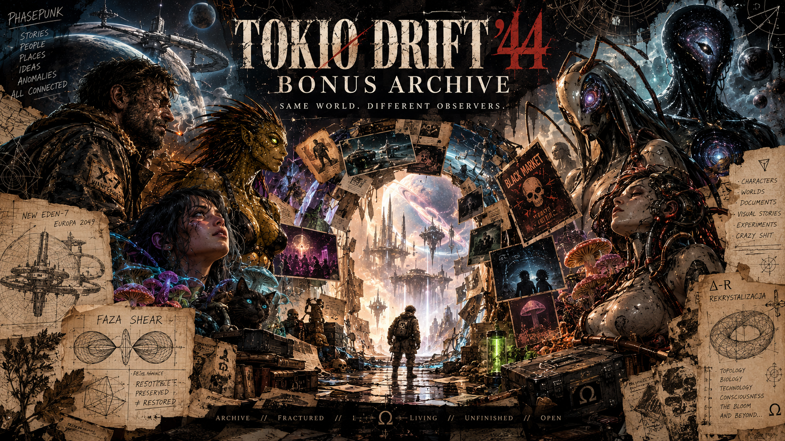
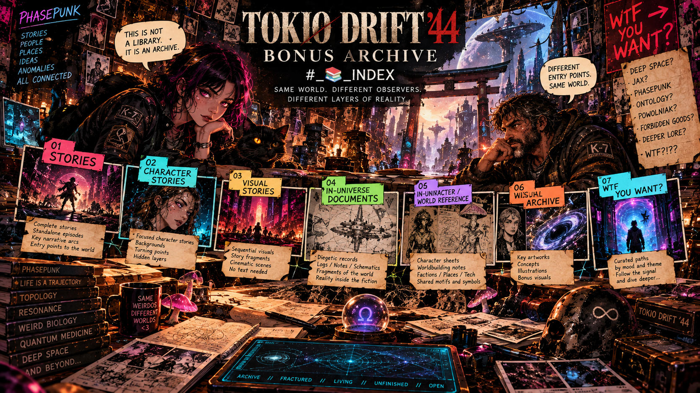
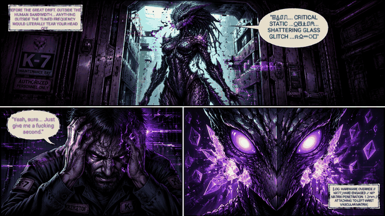

# 📚 TOKIO DRIFT '44 — BONUS INDEX

> A reader's map through the stories, character files,
> experimental texts and narrative artifacts collected in the BONUS archive.

The BONUS folder is not a neatly ordered library.

It is an archive.

Some files are complete stories. Some are character records.
Some are fragments. Some are experiments in narrative form.
Some exist somewhere between fiction, technical language,
worldbuilding and pure PHASEPUNK insanity.

This index is here so you can enter the archive without
having to excavate the whole thing manually.

---

# 📖 STORIES

## 🌀 ATAK NA TOPOLOGIĘ (1/2👹)

**Setting:** New Eden-7 station, Europa orbit, 2049.

A Q-Core habitat is attacked by entities that do not invade
through physical space.

They enter directly into topology.

Captain Lena Kowalska and Powolniak/P-44 have to survive
an attack designed to flatten asymmetry, destroy phas...

👉 [Read ATAK NA TOPOLOGIĘ](./ATAK_NA_TOPOLOGIE.md)

---

## 🧬 FAZA SHEAR 🌌

A short ontological PHASEPUNK piece about two coherent
nodes encountering each other inside a field.

There is no conventional distance.
No signal is transmitted.
No information is exchanged in the usual sense.

Compatibility emerges through geomet...

> Shear is not solved.
> It is embedded.

👉 [Read SHEAR](./Shear.md)

---

## 🍸 ZAPŁADNIATOR 3000 🕺🏻💃🏻

Before the Drift becomes history, Krzysztof encounters
Prism — Mantis hybrid whose biological field is
dangerous to an ordinary human nervous sys...

**Psilocybin nebula stout, absinthe, alien biology and
tradesman-grade engineering included.**

👉 [Read ZAPŁADNIATOR 3000](./Zapladniator_3000.md)

---

## 🌀 Δ-R // RECRYSTALLIZATION 👹

A multi-part narrative centred around Iga, a woman whose
coherence has fallen to Θ = 0.287.

Iga encounters a being known simply as the Guest.

> IDENTITY: PRESERVED ≠ RESTORED

👉 [Read Δ-R // RECRYSTALLIZATION](./%CE%94-R_REKRYSTALIZACJA.md)

---

# 🧠 CHARACTER STORIES

## ⚙️ POWOLNIAK — HARD 👹

 about Powolniak at the point where
her old definition of herself begins to fail.

Copper wire.
Living tissue.
Fungal resonance.
Pain.

👉 [Read POWOLNIAK HARD](./Powolniak_HARD.md)

---

## 🐊 JAX HARD 👹 — REACTANCE OF THE REPTIL CORE

nonlinear biology depends on variation, tension, noise and
phase gradients. When the environment is forcibly phase-locked,
her internal attractor begins to collap...

👉 [Read Jax HARD](./Jax_HARD.md)

---
---

# 🎞️ VISUAL STORIES

## HARDCORE STORY 🙃 👹👹👹

The complete story exists as a single commit containing the
full visual sequence:
**XPT-RUI_1 → XPT-RUI_2 → XPT-RUI_3 → XPT-RUI_4 → XPT-RUI_5 → XPT-RUI_6_FINAL**

Commit itself is the perfect name 🙃

👉 [Open HARDCORE STORY — `Hardcore_Story_🙃`](https://github.com/LifeNode777/TOKIO_DRIFT_44/commit/edcadb1)

---
---

# 💀 IN-UNIVERSE DOCUMENTS

## 💀 BLACK MARKET ☠️

**STATUS: ILLEGAL / HIGH ENTROPY**

 phase smugglers operating beneath the official systems
of the Drift.

Part black-market catalogue.
Part propaganda leaflet.
Part technical manual.
Part piece of forbidden worldbuilding.

👉 [Enter the BLACK MARKET](./%F0%9F%92%80%20Black%20Market%20%E2%98%A0%EF%B8%8F.md)

---
---

# 🗂️ CHARACTER / WORLD REFERENCE

## 🧬 CHARACTER SHEETS

Reference material for the main TOKIO DRIFT '44 characters
and their roles within the wider PHASEPUNK ecosystem.

Currently documented characters include:

- **Architect-Anomaly** ∆§•
- **Powolniak** — Android / Deserter from INFO-Layer
- **Jax** — Reptilian Hybrid / Resonance Junkie
- **XYZ** — Other Hybrid / Universe Antenna
- **???** — unidentified entity / open trajectory

👉 [Open CHARACTER SHEETS](./CHARACTERS_SHEETS.md)

---

# 🖼️ VISUAL ARCHIVE

The BONUS folder also contains a large collection of visual
artifacts:

- character images
- scenes
- posters
- fragments
- PHASEPUNK experiments
- visual jokes
- narrative references
- illustrations connected to individual stories
- standalone images with no corresponding text file
- crazy shit

---

# 🧭 WTF You want?

### Want a story on DEEP SPACE?

👉 [ATAK NA TOPOLOGIĘ](./ATAK_NA_TOPOLOGIE.md)

### Want Jax at the edge of forced coherence?

👉 [Jax HARD](./Jax_HARD.md)

### Want a short piece of pure PHASEPUNK ontology?

👉 [FAZA SHEAR](./Shear.md)

### Want the WTF?!??

👉 [ZAPŁADNIATOR 3000](./Zapladniator_3000.md)

### Want the deeper narrative arc involving Drift,
coherence, topology and identity?

👉 [Δ-R // RECRYSTALLIZATION](./%CE%94-R_REKRYSTALIZACJA.md)

### Want to understand Powolniak?

👉 [POWOLNIAK HARD](./Powolniak_HARD.md)

### Want forbidden goods from the underground?

👉 [💀 BLACK MARKET ☠️](./%F0%9F%92%80%20Black%20Market%20%E2%98%A0%EF%B8%8F.md)

### Want to understand the cast behind the stories?

👉 [CHARACTER SHEETS](./CHARACTERS_SHEETS.md)

---

> ## TOKIO DRIFT '44
>
> **Same world. Different observers.**
>
> **Different layers of reality.**
>
> The archive is open.
>
> **Enter at your own phase risk 🙃.**
