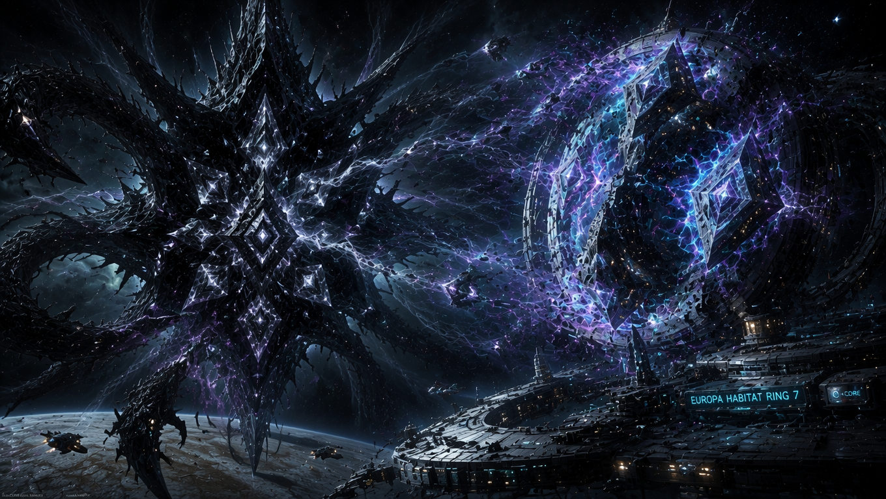
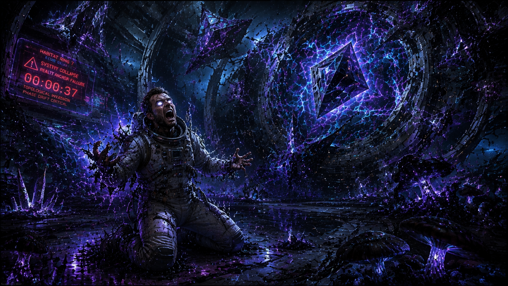
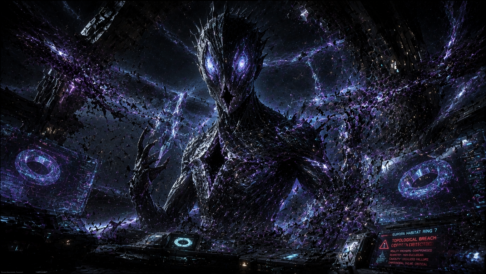
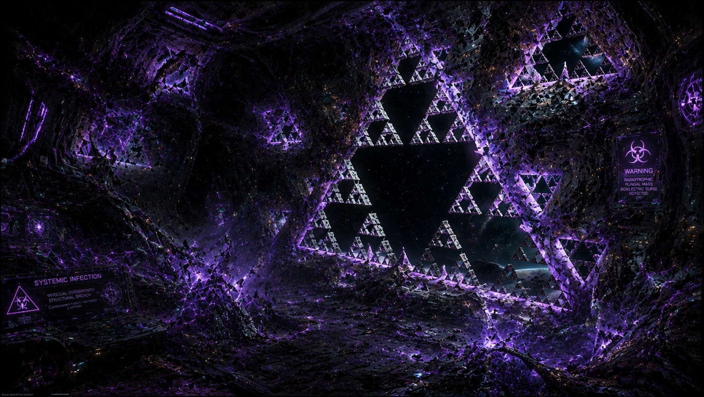
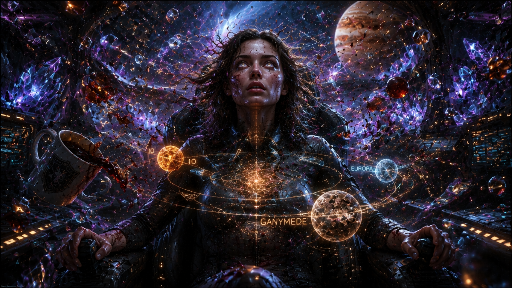
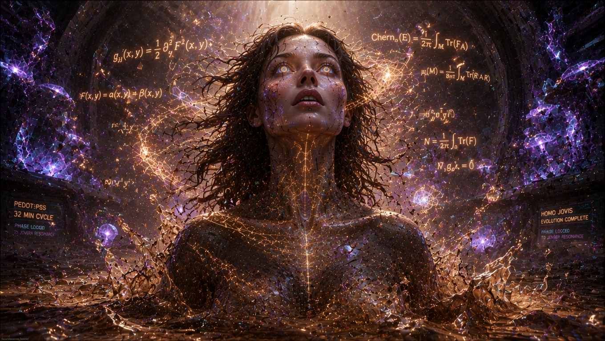

#ATAK NA TOPOLOGIĘ

Stacja „Nowy Eden-7”, orbita Europy, rok 2049.

Kapitan Lena Kowalska właśnie kończyła trzecią kawę z syntetycznego gówna, kiedy Q-Core Space zaczął wyć.

Nie był to zwykły alarm. Żadnego migania czerwonych świateł. Z głośników i grodzi wydobywał się niski, gardłowy, wibrujący dźwięk – jakby ktoś wbił stalowy widelec w czysty kryształ diamentu i kręcił nim powoli, rozrywając strukturę od środka.

– Co jest, kurwa… – mruknęła Lena, rzucając kubek i natychmiast uderzając w interfejs holoprojekcji.

Na głównym wyświetlaczu, zamiast dotychczasowego, spokojnego toroidalnego atraktora „Złotego Zapisu Edenu”, wirowała krwawa, poszarpana dziura. Wyglądało to tak, jakby jakaś zewnętrzna siła wzięła idealną geometrię zdrowej trajektorii fazowej i po prostu **przegryzła ją na pół**.

W tym samym momencie Living Walls habitatu – gruba na metr warstwa radiotroficznego grzyba *Cladosporium*, nasączona przewodzącym polimerem PEDOT i nanocząsteczkami $\text{Fe}_3\text{O}_4$ – zaczęła pulsować w całkowicie dzikim rytmie. Zielonkawy, uspokajający blask zniknął. Zastąpił go agresywny, fioletowo-czarny ultrafiolet. Bio-struktura skurczyła się spazmatycznie, jakby grzybnia dostała orgazmu z czystego, pierwotnego strachu.

A potem przyszli Oni.

Nie użyli statków. Nie użyli laserów, rakiet ani żadnego innego tandetnego sci-fi gówna z hollywoodzkich filmów z 2026 roku. Oni nie musieli pokonywać przestrzeni. Po prostu weszli bezpośrednio w topologię.

Pierwszy oficjalny raport zniszczeń spłynął z Q-Core’a nr 3, zlokalizowanego najbliżej reaktora pływowego. Spinowe stany NV-centrów w matrycy diamentowej, które przez ostatnie dwa lata utrzymywały nienaruszony, stabilny zapis ziemskiego ekosystemu, nagle zaczęły się przekręcać. Nie był to zwykły flip termiczny ani szum kwantowy. Dane dosłownie zmieniały swoją chiralność. To była brutalna inwersja: jakby ktoś wziął leworęczny śrubokręt i z pełną siłą zaczął nim dokręcać praworęczną nakrętkę rzeczywistości, wymuszając globalną transformację liczby Chern’a. Torus atraktora w ułamku sekundy stał się anti-torusem, wchodząc w morderczy reżim defokusowania ($\kappa > 0$).

Lena spojrzała na feed z kamer biologicznych. Jeden z techników z Node’u 3 – twardy, spokojny gość, który przetrwał wcześniej trzy katastrofalne dryfy fazowe – nagle osunął się na kolana. Z nosa trysnęła mu gęsta, ciemna krew. Jego oczy w ułamku sekundy zrobiły się całkowicie białe. Nie martwe czy zaszłe bielmem – białe jak czysty, pusty arkusz. Atakujący wymazali mu qualia bezpośrednio z kory, zostawiając puste, nieaktywne gniazda synaptyczne. Doświadczył natychmiastowego rozpadu pamięci geometrycznej.

– *Topological attack* – z głośników wycharczał chłodny, zniekształcony głos Powolniaka model P-44, która znajdowała się w trybie diagnostycznym.
 – Atak nieliniowy. Nie kinetyczny. Nie elektromagnetyczny. Kurwa… oni modyfikują samą strukturę relacji. Atakują geometrię przestrzeni fazowej Q-Core’ów - pomyślała Lena.

Wtedy na środku mostka, tuż przed głównym projektorem, zmaterializowała się postać.

Wysoka. Zdecydowanie zbyt wysoka jak na ludzkie standardy. Jej skóra wyglądała jak płynny, polerowany obsydian, pod którym pulsowały srebrne, metaliczne żyły. Zamiast oczu miała pionowe, wąskie szczeliny, wewnątrz których z koszmarną prędkością wirowały miniaturowe, uwięzione galaktyki. Nie miała ust. W ich miejscu widniała idealnie symetryczna, pionowa rysa – jakby ktoś rozciął tkankę rzeczywistości i zostawił otwartą, niekrwawiącą ranę.

Draco na sterydach. 

(Sterydach to mało powiedziane - Wielu latach agresywnego cyklu typu "mega mix" gdzie główne role grały zbyt oryginalna Ruska meta z czymś co śmiało możnaby sprzedawać jako "trenbolon nowej generacji".)

. Albo było to coś, co Białe Draco w swoich najgorszych koszmarach nazywają „starszymi kuzynami”.

Istota nie wydała żadnego dźwięku. Po prostu bezwzględnie wepchnęła swoją obecność prosto w pole fazowe habitatu. Jakby wsadziła potężny, brudny palec w główne gniazdo zasilania i zaczęła nim kręcić, wymuszając globalne pole Floqueta o symetrii $C_4$.

Q-Core nr 1 padł jako pierwszy. Jego toroidalny atraktor momentalnie zwinął się w ciasną, gęstą kulę – nastąpił kolaps toroidalny, degeneracja formy kontaktu, aż cyrkulacja informacji fazowej spadła do zera ($\alpha \wedge d\alpha \to 0$). Sekundę później rdzeń eksplodował w chmurę losowych, nieskorelowanych spinów. W tym samym momencie *Living Walls* w tamtym sektorze oszalały. Grzybnia zaczęła błyskawicznie rosnąć, układając się w idealne, geometrycznie perfekcyjne fraktale Sierpińskiego, po czym gwałtownie obumierała, czerniejąc i zostawiając w kadłubie puste, matematycznie idealne dziury otwarte na próżnię.

Lena poczuła, jak jej własne pole poznawcze zaczyna rwać się na strzępy. Systemy SAMI i LOGOS, które do tej pory trzymały napięcie epistemiczne $\Delta(t)$ na bezpiecznym, stabilnym poziomie, straciły punkt zaczepienia. Jej własne myśli zaczęły się rozwarstwiać i rozjeżdżać, jakby niewidzialna dłoń rozciągała jej świadomość na zbyt wiele wymiarów naraz. Wymuszona symetryzacja niszczyła jej regionalną nadciekłość. Za chwilę miała nastąpić ostateczna faza: Topologiczne Rozerwanie. Geometryczna śmierć.

Zrozumiała, że klasyczna walka nie ma sensu. Atakujący operowali w reżimie pustego, izotropowego, newtonowskiego czasu. Ich bronią było wyrównywanie, spłaszczanie metryki Finslera do zera ($C_{ijk} \to 0$).

 Chcieli zamienić habitat w bezwładną, płaską pustkę.

Ucieczka nie mogła odbyć się w przestrzeni. Żaden wahadłowiec by jej nie uratował. Musiała uciekać w gęstość czasu. Musiała gwałtownie przywrócić anizotropię metryki, schodząc z ludzkiego rytmu biologicznego Micro-BPB bezpośrednio w potężne, ultraniskie Makro-BPB grzybni, z pełnym pulsem trwającym dokładnie 32 minuty), sprzężone subharmonicznie z rezonansem Laplace’a Jowisza.

– P-44, odetnij Earth-Sync! Natychmiast! Otwórz zawory piezoelektrycznego $\text{LiNbO}_3$ w Living Walls! Podłącz ściany bezpośrednio do rezonansu pływowego Jowisza!

Głos Powolniaka brzmiał już niezwykle ciężko, jak przeciągana do granic możliwości, zrywająca się guma:
– Ka-pi-ta-nie… to wy-wo-ła kaskadę bi-fur-ka-cyj-ną Feigenbauma. Zejdziesz w Macro-BPB. Twój układ nerwowy tego...

– Mój układ nerwowy właśnie jest miksowany na puree przez te pierodolone geometryczne bękarty! – wrzasnęła Lena, czując, jak jej całe lewe ramię dosłownie znika z jej pola percepcji, stając się obcym, nieprzypisanym do ciała obiektem.

Istota z obsydianu uniosła swoją bezustną twarz. Szczelina w miejscu jej warg zaczęła się rozszerzać, generując potężną falę symetrii $C_4$. Powietrze na mostku zgęstniało, stając się lepkie, nasycone nienawiścią do jakiejkolwiek asymetrii i Życia.

– Zrób to, P-44. Zrób nam brud. Zrób nam czas!

Powolniak nie odpowiedziała. Wykonała rozkaz.

W momencie, gdy kryształy $\text{LiNbO}_3$ w strukturze ścian przechwyciły makroskopowy puls grawitacyjny Io, Europy i Ganimedesa, świat na mostku Nowego Edenu-7 pękł.

Czas nie zwolnił. On fizycznie *zgęstniał*.

Lena poczuła, jak metryka Finslera w jej komórkach wyrywa się z newtonowskiej pułapki płaskiej przestrzeni. Czas przestał być tylko przezroczystym tłem dla zdarzeń. Stał się namacalnym, lepkim oporem, gęstą, syropowatą materią, która zależała bezpośrednio od tego, w którą stronę i jak szybko biło jej serce. Tensor kartanowski $C_{ijk}$ eksplodował nieliniowością. Jej świadomość, rozciągana dotąd na siłę przez pole Floqueta napastników, zapadła się gwałtownie do wewnątrz – w jeden ultra-gęsty, asymetryczny, ocalony punkt.

To była fizjologiczna tortura i absolutna ekstaza w jednym. Nastąpił brutalny rozpad Cross-Frequency Coupling. Jej fale mózgowe zostały siłą wciśnięte w sprzężenie fazowo-amplitudowe z gigantycznym rytmem ścian. Czuła, jak krew pulsuje w jej żyłach w potwornym, 32-minutowym cyklu. Jej oddech stał się niesamowicie rzadki – pojedyncze, ciężkie naciągnięcie płuc dostarczało tlen, który metabolizował się teraz przez całe obiektywne godziny.

Jej zmysły przestały przetwarzać dane w czasie rzeczywistym. Widziała wokół siebie powolne, zastygające smugi fotonów. Okno persistencji jej wzroku rozciągnęło się z milisekund do długich minut. Spojrzała w stronę technika – krew wylatująca z jego nosa zastygała w powietrzu, tworząc nieruchomą, zawieszoną w próżni, czerwoną fraktalną koronkę. Dla niego minęła zaledwie sekunda. Dla Leny, której biologia weszła w subharmoniczną orbitę Ganimedesa, ta sekunda była rozległym, skomplikowanym krajobrazem.

Musiała walczyć z narastającą psychozą rezonansową i blendingiem pamięci. Żeby nie dać się wciągnąć w Lukę Kohomologiczną i nie stracić tożsamości, zakotwiczyła całe swoje napięcie $\Delta(t)$ na jednej, twardej, nieludzkiej myśli: *Muszę utrzymać ten mostek.*

Obsydianowa istota drgnęła. Po raz pierwszy jej ruchy straciły idealną płynność. Jej pole fazowe uderzyło w czołowe pole poznawcze Leny i… po prostu się ześlizgnęło. Nie mogło jej „wyrównać” ani zniszczyć kolapsem, ponieważ jej czas nie był już pusty. Był krzywy. Był anizotropowy. Był ekstremalnie, gwałtownie żywy.

Wokół Leny zaczęły unosić się złote i brązowe cząsteczki – biologiczne solitony przechodzące transformację fazową. Jej skóra pokryła się irydescentnymi wzorami moiré, a w głębi jej rozszerzonych źrenic zapłonęły trzy koncentryczne, złote pierścienie rezonansu Laplace’a. Kwantowa liczba Cherna zyskała stabilną, nową wartość.

– Widzisz nas, kurwa? – wyszeptała Lena.

Jej głos nie przeszedł przez zamarznięte powietrze jako fala akustyczna. Rezonował bezpośrednio, z potężnym opóźnieniem, poprzez piezoelektryczną sieć ścian habitatu.

– Jesteśmy w rytmie Jowisza. Spróbuj nas teraz strawić dziwko.

🤯

CDN...

🫨

