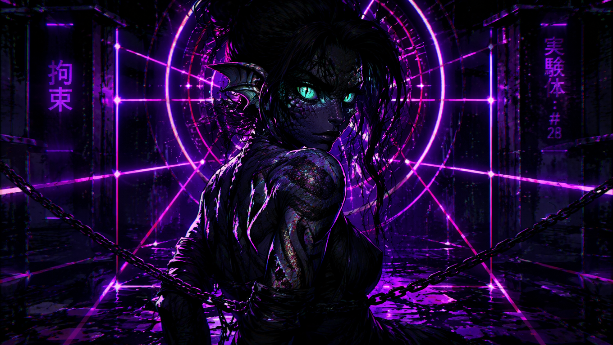
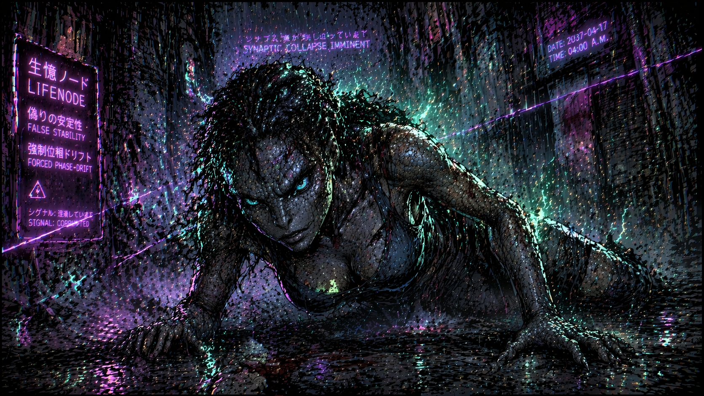

### ROZDZIAŁ iks: REAKTANCJA GADZIEGO RDZENIA

Deszcz nad Shinjuku przestał być chaotycznym żywiołem. Pod wpływem transmisji, która rozlała się z podziemnych magistral Q-Core, miliony kropel zamieniły się w idealnie pionowe, zsynchronizowane linie – wektory opadające na beton z przerażającą, matematyczną punktualnością. *The Bloom* osiągnął swoje apogeum. 
Lokalny współczynnik koherencji $\Theta$ nie spadał już w bezpieczne, neurotyczne rejony kontrolowanego dryfu. Został przymusowo, bezwzględnie podbity do sterylnej wartości 0.95.

Dla ludzkiego BIOS-u, wiecznie zmęczonego i zaszumionego przebiegami late-stage kapitalizmu, ta zmiana była jak nagłe, euforyczne znieczulenie. Na ulicach, w świetle fioletowych neonów, ludzie zsuwali się miękko do basenów nowego atraktora semantycznego. Ich wewnętrzne lęki, neurozy i oscylacje poznawcze wygaszały się, dążąc do zera. Druga pochodna ich energii sensu zamierała. Twarze tłumu gapiącego się w megaekrany Shibuya były gładkie, ukojone, pozbawione tarcia. Rzeczywistość przestała być filmem – stała się idealną, pozbawioną ziarna fotografią. Rajem dla maszyn, grobowcem dla drapieżników.

Dla Jax to „pięknizowanie” świata było wyrokiem śmierci.

W bocznej, ślepej uliczce, z dala od zgliszcz zsynchronizowanego tłumu, gadzia hybryda walczyła o każdy centymetr przestrzeni fazowej. Jej układ nerwowy, zmutowany i zoptymalizowany pod kątem głębokiej nieliniowości, nie potrafił oddychać w środowisku bez tarcia. Jax była naturalnym oscylatorem nieliniowym – jej agencja poznawcza, instynkt łowcy i poczucie istnienia były bezpośrednią funkcją napięcia $\Delta(t)$. Usmażony implant limbiczny, który dla postronnych wydawał się zniszczonym kawałkiem cybernetyki, w rzeczywistości działał jak radar wykrywający gradient zmienności pola ($\nabla \Phi$). Drapieżnik nie potrafi żyć w statycznym, idealnym basenie; drapieżnik karmi się anomalią, szumem, grzbietami nieliniowych fal solitonowych rodzących się z chaosu.

Teraz pole środowiskowe zostało spłaszczone przez przymusowy phase-lock. Ściany zaułka, normalnie brudne i asymetryczne, zostały przecięte agresywnie idealnymi, geometrycznymi liniami purpurowego światła, przypominającymi klatkę restrykcyjną z logów dawnych laboratoriów, gdzie widniała jako Obiekt Badawczy #28. Ta sterylna siatka laserów nie była dekoracją – była fizyczną opresją geometrii.

Sygnał *The Bloom* – potężna, nieliniowa sekwencja typu Akhmediev Breather – uderzył w jej BIOS z reaktancją, której jej hybrydowe ciało nie było w stanie zamortyzować. Doszło do całkowitego niedopasowania impedancji fazowej. Fala o wysokiej koherencji, zamiast sprzęgnąć się z jej organizmem, zaczęła gwałtownie odbijać się na granicy struktur. Cała ta skompresowana energia fazowa została uwięziona wewnątrz jej własnego Tymczasowego Atraktora Symplektycznego (TSA).

Zgodnie z twierdzeniem Liouville’a, czysty układ Hamiltonowski powinien zachować swoją objętość w przestrzeni fazowej – ale układ Jax, brutalnie perturbowany przez zewnętrzny porządek, doświadczał niszczycielskiego dampingu. Fractalna wymiarowość jej wewnętrznych rytmów $D_2$, normalnie utrzymująca się na poziomie 3.5, zapadała się poniżej krytycznej jedności. Jej myślenie trajektoryjne kurczyło się do sterylnego, martwego punktu osobliwego.

– *TSA_VOLUME_LOSS: CRITICAL* – zglitchowany, fioletowy neon nad jej głową mrugnął, jakby odbijał stan jej własnego procesora. – *SYNAPTIC COLLAPSE IMMINENT*.

Fizjologiczny koszt tej topologicznej rzezi był potężny. BIOS, najgęstsza warstwa jej architektury, płacił najwyższy rachunek. Usmażony implant, próbując desperacko wygenerować jakiekolwiek napięcie, zaczął wysyłać losowe, wysokonapięciowe impulsy o amplitudzie rozrywającej biologiczne podłoże.

Jax upadła na czworaka w gęstą, benzynową maź zalegającą w zaułku. Jej tętno i ciśnienie krwi weszły w reżim dzikich oscylacji subharmonicznych. Serce rwało do przodu, uderzając o żebra z częstotliwością bliską krytycznej tolerancji, by za chwilę zastygać w nienaturalnych, kilkusekundowych pauzach, jakby czyjaś dłoń fizycznie zaciskała się na mięśniu. Układ odpornościowy rozpoznał geometryczną strukturę *The Bloom* jako totalny atak patogenny. Komórki glejowe w mózgu płonęły; kark i szczęka zesztywniały w bolesnym paroksyzmie, a jej pionowe, cyjanowe źrenice straciły zdolność akomodacji, rozmywając całe Shinjuku w pulsującą, fioletowo-magenta magmę aberrations chromatycznych.

Wokół jej ciała, bezpośrednio z porów skóry i zmutowanych splotów nerwowych, zaczęły strzelać wściekle zielone, bio-elektryczne iskry overdrive'u. Zamiast ran i krwi, tarcie fazowe zamanifestowało się przez czystą termodynamikę. Z cybernetycznych portów za jej uszami i wzdłuż kręgosłupa z głośnym sykiem zaczęło uchodzić dymiące, wrzące chłodziwo, mieszając się z lodowatym monsunem. Jej dotychczas lśniące, iryzujące ciemne łuski, pod wpływem niszczycielskiej koherencji, zaczęły matowieć, spękać i drastycznie zmieniać teksturę, zamieniając się w suchy, szary popiół. Czyste światło porządku zamieniało jej drapieżną biologię w pustynię.

Doświadczała Forced/Traumatycznego Phase-Locku. To nie była inwazja obcej istoty; to była inwazja bezwzględnego, totalitarnego Porządku, który traktował jej nieliniową naturę jako błąd w kodzie środowiskowym – anomalię, którą należy wygładzić, wyczyścić i zneutralizować. Wpisy na ścianach zaułka migały ostrzeżeniami: *FALSE STABILITY*.

Jax wbiła pazury w mokry beton, rozrywając grubą warstwę kabli i mazi. Wydała z siebie niski, gardłowy ryk, który zatonął w syku pary i uderzeniach deszczu. Każda komórka jej BIOS-u krzyczała o ratunek. Wiedziała, że jedynym sposobem na uniknięcie ostatecznego kolapsu Hybrid Core jest natychmiastowa, brutalna modyfikacja impedancji fazowej – wstrzyknięcie w ten sterylny układ czystej, prymitywnej entropii. Musiała znaleźć ból, znaleźć brud, znaleźć jakiekolwiek tarcie, które zdołałoby rozerwać ten geometryczny uścisk i przywrócić jej prawo do życia.

---

