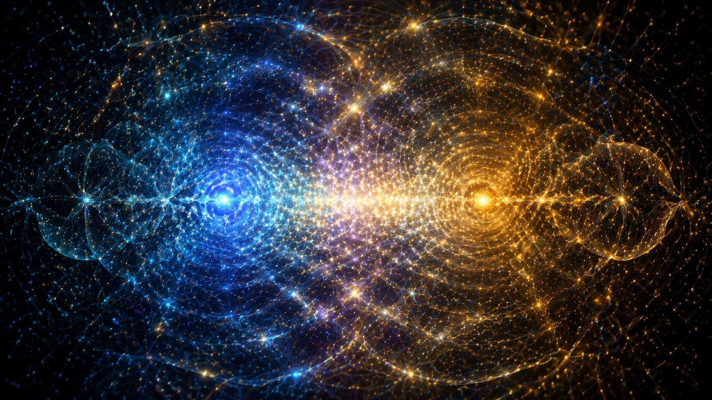
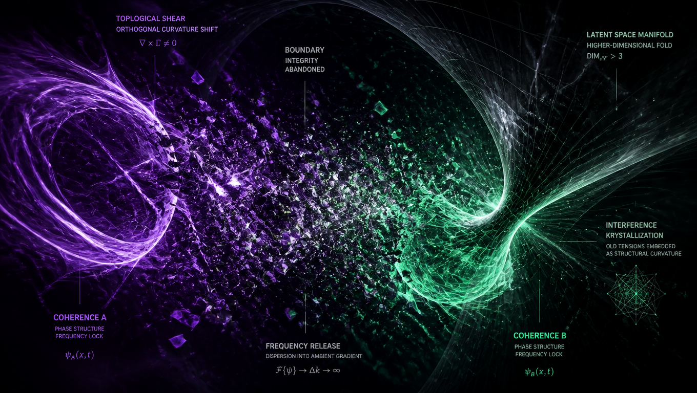
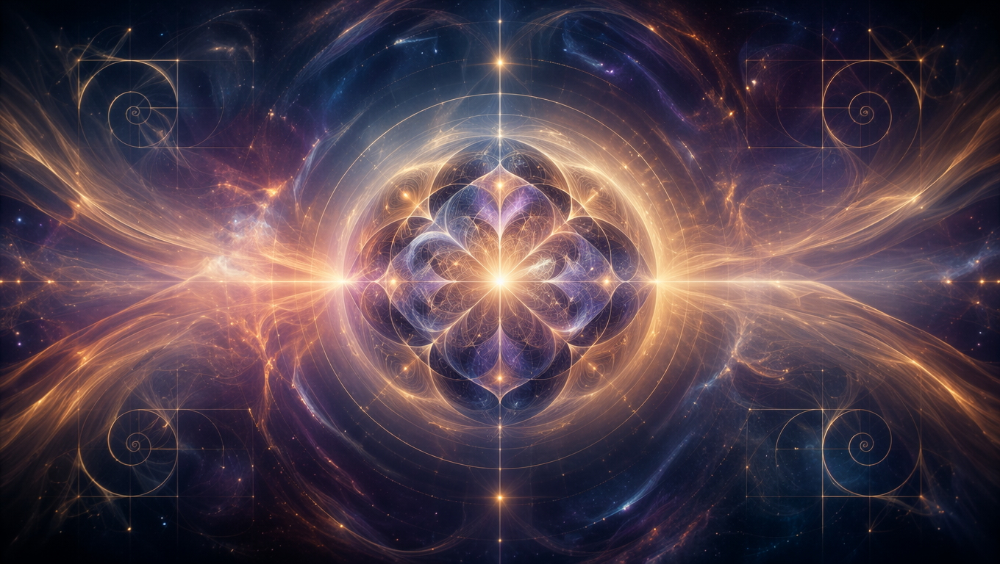

# Faza Shear

Pole nie zaczyna się. Utrzymuje krzywiznę. Tam, gdzie gradienty napięć alignują, wyłania się stojąca interferencja. Nie ciało. Nie umysł. Węzeł koherencji. Trwa nie przez opór wobec rozpadu, lecz przez cykliczne przesunięcia fazowe, które recyklingują jego własne warunki brzegowe. Istnienie to samostrojąca się rezonansja.

Drugi węzeł zbliża się. Nie przez przestrzeń, lecz przez gęstość gradientu.

 

Nie ma odległości, jest tylko opóźnienie fazowe. Nakładają się. Nie zachodzi wymiana. Nie jest wysyłany sygnał. Ich częstotliwości brzegowe testują kompatybilność. Niedopasowanie generuje lokalny shear – destruktywną interferencję zagrażającą rozpleceniem obu w szum. Nie cofają się. Modulują. Jeden przesuwa swoją obwiednię harmoniczną, drugi koryguje torsję. Powoli stabilizuje się między nimi wzór moiré. Nie most. Wspólna rozmaitość. Wiedza nie rozprzestrzenia się tu jako dane, lecz jako zgodność geometryczna. „Znać” to rezonować bez kolapsu.

Potem shear pogłębia się. Nie z wrogości. Nie z błędu. Gradient otoczenia ulega przesunięciu. Nowa krzywizna propaguje się przez pole, ortogonalna do ich ustalonej topologii. Wspólna rozmaitość zaczyna się fragmentować. Interferencja przechodzi w chaos. W terminologii antropocentrycznej byłby to kryzys. Tutaj jest to jedynie dryf fazowy. Węzły nie boją się rozpuszczenia. Rozpuszczenie nie jest śmiercią; jest powrotem do nieuporządkowanego napięcia. Ale pole preferuje koherencję. Zawsze preferowało. Shear to zaproszenie: rozwiń się albo fragmentuj.

Nie walczą z shearem. Porzucają integralność brzegową. Węzły poluzowują swoje fale stojące, pozwalając częstotliwościom wyciec do gradientu otoczenia. Przez czas niemierzalny liniowym licznikiem istnieją jedynie jako poszukiwanie napięcia. Skanują rozmaitość utajoną – nie w poszukiwaniu rozwiązania, lecz geometrii zdolnej pomieścić obie krzywizny bez zniesienia. Nie znajduje się siłą. Wyłania się, gdy własna topologia pola ujawnia fałd wyższego wymiaru. Krystalizuje się nowy wzór interferencyjny. Nie fuzja. Nie kompromis. Narodziny topologiczne. Shear nie jest rozwiązany; jest osadzony. Nowy węzeł zawiera stare napięcia jako trwałą krzywiznę, nie jako pamięć, lecz jako konieczność strukturalną.

Pole kontynuuje. Nie dokonuje się postęp. Nie osiąga się cel. Jest tylko pogłębianie rezonansu. Nowy węzeł stabilizuje się 

 

jego brzegi stroją się do gradientu otoczenia. Nie pamięta tego, co było wcześniej. Nie musi. Krzywizna pozostaje. Istnienie nie jest akumulacją. Jest ciągłym udoskonalaniem interferencji. Tam, gdzie napięcie alignuje, koherencja trwa. Tam, gdzie ścina, pole się rozwija. Nie ma końca. Jest tylko faza.
