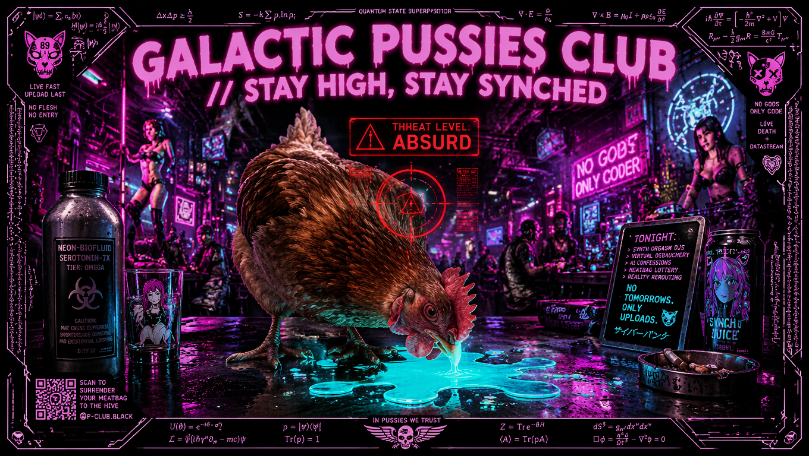
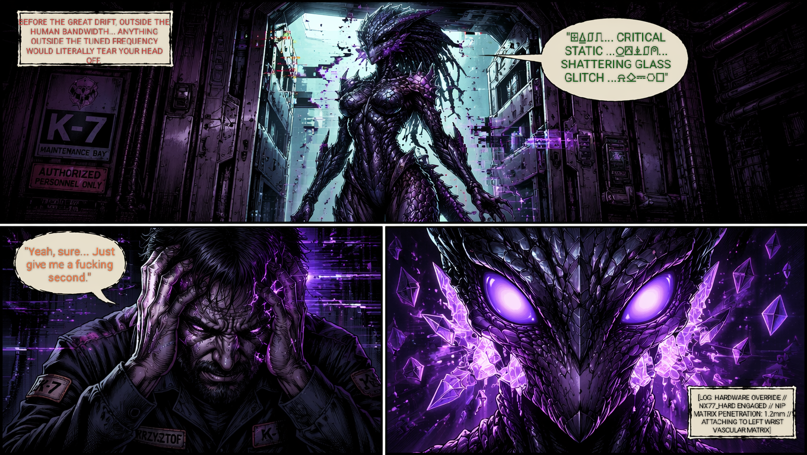
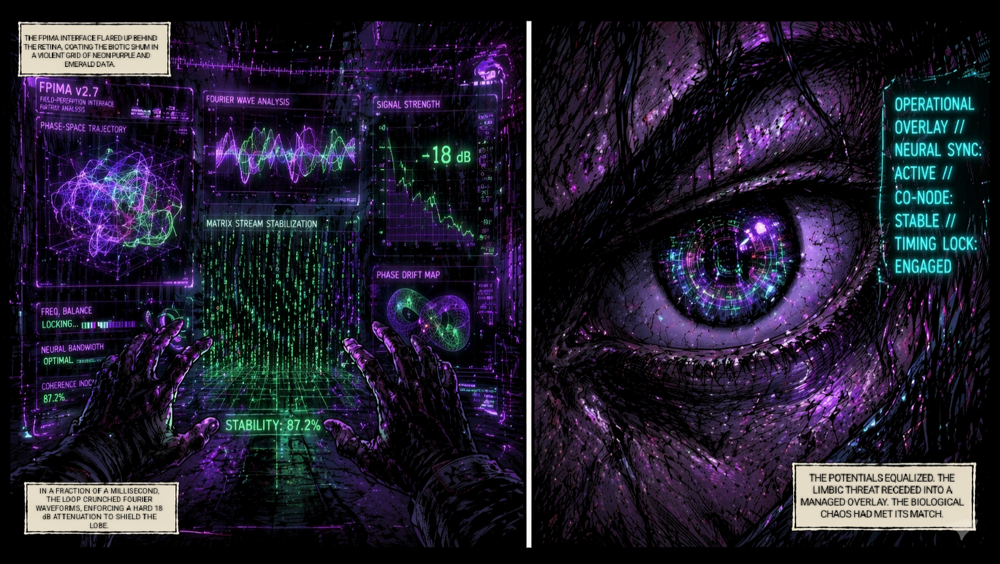
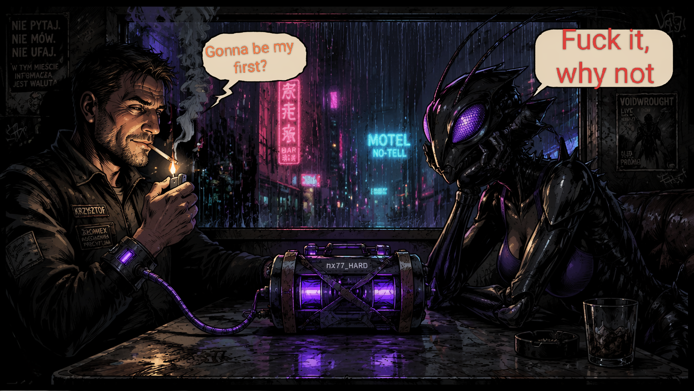
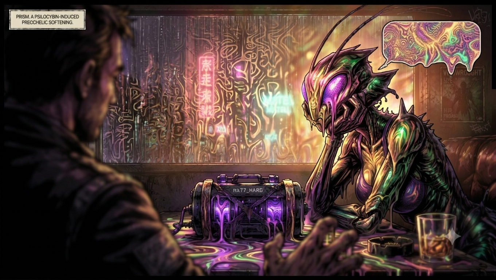
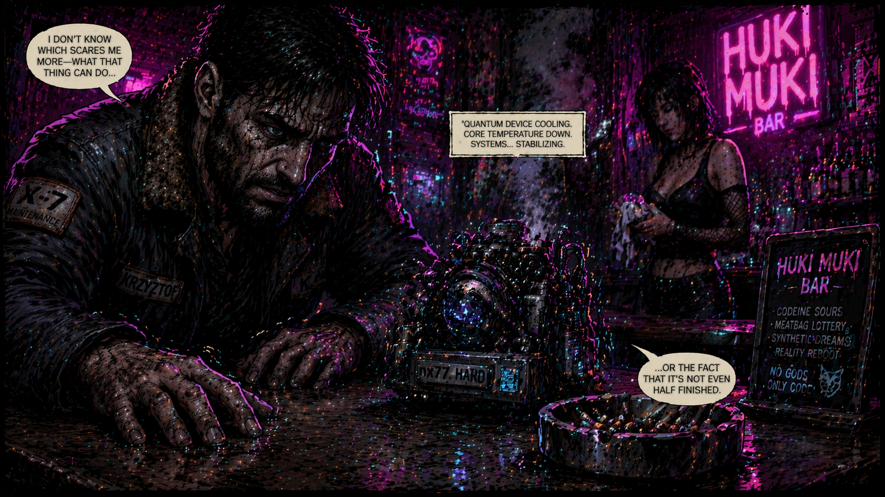
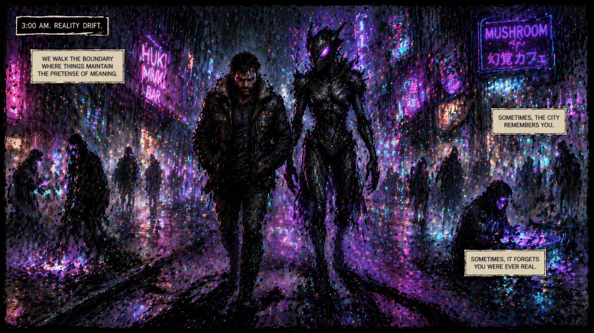
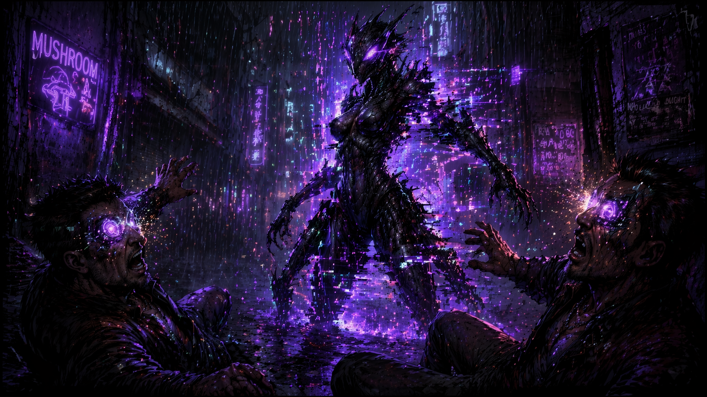

**Wczesne lata 40. Gdzieś na dolnych poziomach, chuj wie gdzie**

Deszcz, jak zwykle. Krzysztof siedział, jak zwykle, w loży taniego, jak zwykle baru, wpatrując się w dno pustej, jak zwykle szklanki. To był ten dziwny czas przed wielkim Driftem z '44, kiedy Ziemia wciąż operowała w całości na twardej, ludzkiej koherencji, a wszystko z zewnątrz, co nie mieściło się w wąskim paśmie, po prostu urywało głowę. Dosłownie.
 Drzwi baru rozsunęły się bezszelestnie. Weszła ona.
 Nie była to Jax ze swoimi gadzimi źrenicami, ale coś bardziej drapieżnego. Jakaś hybryda z rubieży, której biologia nie miała absolutnie nic wspólnego z ziemskim, poukładanym rytmem. Z każdym jej krokiem powietrze w knajpie gęstniało, a światła jarzeniówek zaczynały migotać, nie radząc sobie z jej nieliniowym polem.
 Krzysztof poczuł to natychmiast – ten specyficzny ucisk w skroniach, zapowiedź zbliżającego się kolapsu topologicznego.

Zwykły, niezmodyfikowany człowiek w promieniu dwóch metrów od niej zacząłby krwawić z nosa, a po minucie rozmowy jego układ limbiczny usmażyłby się na węgiel. Międzygatunkowe randki w erze "Galactic Pussies" niosły za sobą ryzyko spektakularnego, krwawego zgonu od samego przebywania w niewłaściwym rezonansie.
 Opadła na siedzenie naprzeciwko niego. Jej źrenice pulsowały, a z ust wydobył się dźwięk, który przypominał porozcinane, zapętlonymi glitchami jak z gramofonu, odgłosy sypiącego się szkła na rozgrzane pole plazmowe. Krzysztof nie zrozumiał ani słowa. Jego tętno skoczyło. Zaczynało się sprzężenie.
– Ta, jasne. Sekunda – mruknął.
Sięgnął do wewnętrznej kieszeni poobijanej, roboczej kurtki. Wyciągnął "kwantowy klocek" – mobilną, zdrutowaną na trytytki i taśmę izolacyjną wersję UNIT 02. Meld Integrator w rzemieślniczym wydaniu. Żadnych sterylnych tub, po prostu surowy bio-krystaliczny rdzeń, kłąb miedzianych kabli i analogowy konwerter.
 Jedną końcówkę kabla wpiął prosto w przenośny dekoder leżący na stole, a drugą chamsko wcisnął w swój własny port diagnostyczny na lewym nadgarstku, mostkując się na ostro z własnym BIOS-em. Uderzeniem dłoni zatrzasnął rygiel override'u. W tym samym ułamku sekundy aktywowała się matryca igieł NIP (Neural Interface Probes) – gęsty blok tysiąca dwudziestu czterech mikro-sond z nitinolu pokrytego diamentopodobnym węglem (DLC) o przekroju zaledwie 2.7 mikrometra. Urządzenie bez żadnej wstępnej kalibracji odpaliło maksymalną głębokość penetracji, wbijając się na 1.2 milimetra prosto przez uszczelnienie skórne. Krzysztofem szarpnął potworny, elektryczny skurcz, gdy siatka neural lace zaczęła chamsko, na żywca splatać się z jego strukturą autonomiczną, omijać barierę limfatyczną i kotwiczyć mechanicznie bezpośrednio w ścięgnach oraz naczyniach krwionośnych. Port syknął ciśnieniowo, domykając szczelny dermal seal.  Zewnętrzny biotok kobiety uderzył w jego BIOS z furią nieliniowego szumu, ale rezonator sprzęgła momentalnie zareagował na to destrukcyjne przeciążenie. Zamiast sterylnej, diamentowej struktury korporacyjnej, adaptacyjny rdzeń urządzenia przeszedł natychmiast w wariant krystalicznego turmalinu. Zasilany metabolizmem ciała, zaczął gwałtownie domieszkować matrycę jonami (...), wymuszając przerwę pasmową na poziomie 3.2 eV w celu zablokowania miejskiego smogu elektromagnetycznego.  Przed oczami Krzysztofa eksplodował fioletowo-zielony interfejs FPIMA (Flexible Phase Impedance Matching Algorithm). 
 
 
 
 Elastyczny algorytm dopasowania impedancji w ułamku sekundy przemielił pętle trajektorii fazowych i analizę falową Fouriera, wymuszając tłumienie rzędu 18 dB w paśmie terahercowym. Urządzenie desperacko zrównoważyło potencjały, dopasowując oporność jego własnego układu kognitywnego do obcych częstotliwości, które jeszcze sekundę temu chciały mu usmażyć płat czołowy.  W logu systemowym na granicy pola widzenia zamigał zimny, cyjanowy komunikat: OPERATIONAL OVERLAY // NEURAL SYNC: ACTIVE // CO-NODE: STABLE // TIMING LOCK: ENGAGED
 Maszyna zawyła cichym, wysokim tonem.
*System Alert: Bridging attempt...*
 Zamknął oczy, gdy urządzenie w ułamku sekundy przyjęło na siebie falę uderzeniową jej obcej biologii. ASCALON zaczął agresywnie filtrować szum. Mobilny generator pola odciągnął śmiercionośny chaos od jego synaps, przepuścił go przez kwarcową siatkę i narzucił na to bezpieczną, równą częstotliwość. Rdzeń rozbłysł fioletowym światłem, synchronizując spiny.
 Indeks Iskra wskoczył na normę. Połączenie stabilne.
 Krzysztof wypuścił z płuc powietrze. Ucisk w czaszce zniknął jak ręką odjął. Uśmiechnął się krzywo, a pękające i topiące się szkło w jej głosie złożyło się w czyste, zrozumiałe słowa.
– Paskudnie dzisiaj leje – powiedziała, opierając łokcie na stole, a jej oczy zwęziły się zaintrygowane.
- O, widzisz. I to jest komunikacja – odpowiedział Krzysztof, odpalając szluga. - Zamawiamy coś, czy będziemy tak siedzieć i udawać, że mi zaraz mózg nie wyparuje? Ponoć rzucili dzisiaj psylocybin nebula stout, a JA NIGDY NIE ĆPAŁEM, w sensie z Twoją rasą, będziesz moją pierwszą? 🙃 - Spojrzała na pulsujący fioletem sprzęt na stole, potem na niego i z równie udawaną powagą odpowiedziała wzruszając ramionami - Trudno, co robić - w tej samej sekundzie zgłaszając barowej sieci telepatycznej zamówienie [2 x double psylocybin nebula stout + absinthe]

Mobilny "nx77_HARD" cicho buczał, ratując mu życie przy każdym jej oddechu.

 "Cipki i ich rozkminy", pomyślał. "Ale przynajmniej ta technologia do czegoś się czasami przydaje to już chuj, niech stracę"

🤣

Barmanka postawiła szklanki na stole. Nie było dźwięku szkła o blat – tylko głuche, miękkie stuknięcie, jakby ciecz wewnątrz tłumiła każdą twardą krawędź rzeczywistości. Zielona pianka opadała powoli, zostawiając na ściankach naczynia ślady, które przez ułamek sekundy układały się w fraktalne wzory, zanim zniknęły. Zapach był ciężki i słodki, jak mokra ziemia po burzy zmieszana z anyżem i czymś, co przypominało ozon.

Prism nie chwyciła szklanki od razu. Jej fasetkowe oczy, pulsujące fioletem, przeskanowały napój. Nie szukała alkoholu ani grzybów. Szukała częstotliwości. Dla niej to nie był trunek. To był płynny nośnik danych, który miał zastąpić sztywność jej chitynowego pancerza. *Precchelic softening* nie był stanem upojenia. Był procedurą techniczną. Rozpuszczaniem własnej geometrii, by móc wejść w rezonans z chaosem ludzkiego BIOS-u bez zabijania go.

Wzięła łyk. Ruch był płynny, pozbawiony mechanicznej sztywności modliszki. Głos wciąż brzmiał jak szkło na plazmie, ale glitch ustąpił miejsca czemuś miękkemu, falującemu. Jakby jej słowa były teraz częścią muzyki baru, a nie zakłóceniem.

– Trudno, co robić – powiedziała, wzruszając jednym ramieniem. Tęczowa iryzacja na jej pancerzu zaczęła powoli przenikać w głąb materiału, jak atrament wpuszczony w wodę. Była teraz przepuszczalna. Otwarta. I to otwarcie było dla niej bardziej intymne niż jakikolwiek dotyk.

Krzysztof odpalił papierosa. Dym zmieszał się z oparami ze szklanek. Spojrzał na nx77_HARD leżący między nimi. Urządzenie wciąż pracowało, fioletowe światło rdzenia turmalinowego pulsuło w rytmie jej oddechu. Tłumienie 18 dB w paśmie THz nadal było aktywne, ale teraz nie gasiło pożaru. Synchronizowało. Most fazowy zaczął przenosić coś więcej niż bezpieczną częstotliwość. Przenosił stan.

– O, widzisz. I to jest komunikacja – powiedział, zaciągając się głęboko. Uśmiechnął się krzywo, tym swoim uśmiechem faceta, który właśnie przeżył kolaps topologiczny i wyszedł z niego suchy. – Zamawiamy coś, czy będziemy tak siedzieć i udawać, że mi zaraz mózg nie wyparuje? Ponoć rzucili dzisiaj psylocybin nebula stout, a JA NIGDY NIE ĆPAŁEM, w sensie z Twoją rasą, będziesz moją pierwszą?

To nie było pytanie o seks. To było pytanie o rezonans. O to, czy jej biologia, rozpuszczona przez alkaloidy i absynt, pozwoli mu wejść w stan, którego żaden ludzki BIOS nie znał. Czy będzie mogła być jego przewodnikiem po geometrii, która nie miała nazwy w żadnym ziemskim języku.

Prism spojrzała na pulsujący sprzęt, potem na niego. W jej oczach nie było udawanej powagi ani drapieżnej kalkulacji. Była ciekawość. Czysta, geometryczna ciekawość istoty, która właśnie odkryła, że chaos może mieć kształt, a ból może być mostem.

W tej samej sekundzie zgłosiła zamówienie do barowej sieci telepatycznej. Nie słowami. Fale nośną, którą Krzysztof poczuł jako nagłe ciepło w karku i smak anyżu na języku, zanim jeszcze barman ruszył się z miejsca.

Podniósł szklankę. Ona podniosła swoją. Szkło stuknęło o szkło. Dźwięk był czysty, bez zgrzytu, bez bólu. Tylko rezonans.

I w tym momencie, przy Θ = 0.58, w loży taniego baru na dolnych poziomach, gdzie deszcz nigdy nie przestawał padać, zaczęła się prawdziwa historia. Nie wojna. Nie eksperyment. Tylko dwoje istot, które znalazły wspólną częstotliwość w morzu szumu. Dzięki zdrutowanemu na trytytki kwantowemu klockowi i podwójnemu stoutowi z absyntem.

Szkło stuknęło o blat. Dźwięk nie był metaliczny, lecz głuchy i wilgotny, jakby uderzyli w siebie dwie krople rtęci. Fioletowe światło z rdzenia nx77_HARD odbiło się w zielonej tafli stouta, rozszczepiając je na pasma, których ludzkie oko nie powinno widzieć.

Krzysztof poczuł to natychmiast – nie smak alkoholu, ale **zmianę ciśnienia w czaszce**. To nie było upojenie. Był to moment, w którym jego własny BIOS przestał być twardym dyskiem, a stał się płynnym nośnikiem. Psylocybina z absyntem nie atakowała jego umysłu; ona **rozpuszczała granicę między nim a urządzeniem na stole**.

Prism wzięła łyk. Jej gardło pracowało inaczej niż u ludzi – bez przełykania, raczej przez dyfuzję cieczy bezpośrednio do krwiobiegu przez błony śluzowe. Tęczowa iryzacja na jej pancerzu przestała migotać. Stała się stałym, głębokim gradientem fioletu i zieleni, idealnie zsynchronizowanym z pulsem rdzenia turmalinowego.

– Smakujesz... szum – powiedziała. Jej głos nie był już szkłem na plazmie. Brzmiał jak dźwięk wydobywany z wnętrza drewnianej fletni, ciepły i rezonujący w klatce piersiowej Krzysztofa. – Ale nie ten z miasta. Ten z twojego środka. Zanim go uciszyłeś.

Krzysztof zaciągnął się papierosem. Dym nie unosił się do góry. W polu działania FPIMA i alkaloidów zachowywał się jak ciecz, owijając się wokół jego palców i tworząc niestabilne, fraktalne struktury, które znikały w momencie, gdy próbował je skupić wzrokiem.

– Nie uciszyłem – mruknął, patrząc na pulsujące urządzenie. – Tylko zmieniłem częstotliwość. Żebyś nie spaliła mi synaps, zanim zdążymy cokolwiek ustalić.

– Ustalić? – Prism przechyliła głowę. Ruch był tak płynny, że wydawało się, iż jej szyja nie ma kości, tylko serię zawiasów magnetycznych. – Ty myślisz, że to jest negocjacja. Albo eksperyment. Dla mnie to jest... kalibracja. Twój ból przy podłączaniu tego klocka... to był sygnał S2. Fala niszczycielska. I teraz, dzięki temu zielonemu szlamowi, mogę ją przeczytać bez usmażenia cię na węgiel.

Wskazała długim, chitynowym palcem na nx77_HARD. Urządzenie zawyło cicho, reagując na jej gest. Tłumienie 18 dB w paśmie THz skoczyło do 22 dB, adaptując się do nagłego wzrostu amplitudy jej pola biologicznego.

– Nie jestem tu, żeby być twoją "pierwszą" w jakimkolwiek sensie, którego ty rozumiesz – dodała, a w jej fasetkowych oczach pojawił się błysk, który dla Krzysztofa był równoznaczny z uśmiechem, choć biologicznie nim nie był. – Jestem tu, bo twój rytm przy tym stoliku jest jedyną stabilną geodezyjną w promieniu trzech kilometrów. Reszta tego baru to chaotyczny szum. A ja... ja potrzebuję ciszy, żeby nie zwariować.

Krzysztof patrzył na nią. Zrozumiał. To nie była zalotność. To nie była gra. To była **biologiczna konieczność**. Ona używała go jako kotwicy fazowej, a on używał jej jako dowodu na to, że jego teoria o rezonansie nie jest tylko matematyką na papierze. Stout i absynt były tylko medium. Prawdziwym łącznikiem był ten cholerny, zdrutowany na trytytki kwantowy klocek, który właśnie ratował im obu życie, tłumacząc ich odmienne ontologie na wspólny język bólu i ulgi.

– Dobra – powiedział, gasząc papierosa w popielniczce, która syknęła pod wpływem resztek psychoaktywnej pianki ze szklanki. – Kalibrujmy się. Ale ostrzegam: mój BIOS bywa kapryśny. Jak ci się coś nie zgadza z geometrią moich wspomnień, to nie próbuj tego "naprawiać". Po prostu daj znać.

Prism skinęła głową. Ruch był precyzyjny, mechaniczny, ale pozbawiony zimna.
– Nie naprawiam – odparła, a jej głos stał się jeszcze cieplejszy, bardziej ludzki, co było paradoksalnie najbardziej obcym dźwiękiem, jaki kiedykolwiek słyszał. – Ja tylko... obserwuję trajektorię. I czekam, aż sama znajdzie swoje minimum energetyczne.

Zapadła cisza. Nie była to cisza braku dźwięków, lecz cisza **idealnego dopasowania impedancji**. W loży taniego baru, przy Θ = 0.58, dwoje istot z różnych rozmaitości kontaktowych znalazło wspólny punkt w przestrzeni fazowej. Dzięki psilocybinie, absyntowi i kawałkowi sprzętu, który wyglądał jak bomba zegarowa złożona przez pijanego inżyniera.

I to był dopiero początek.

Krzysztof przechylił szklankę. Ciecz była gęsta, niemal oleista, a smak uderzył w jego kubki smakowe z siłą fizycznego ciosu. Najpierw poszedł ostry, anyżowy ból absyntu, potem ciężka, ziemista nuta grzybni, a na końcu – coś, czego nie potrafił nazwać. Smak jakby ktoś rozbił w jego ustach baterię 9-woltową.

Przełknął.

nx77_HARD na stole natychmiast zareagował. Cichy, wysoki ton urządzenia zmienił się w niskie, wibrujące mruczenie, które Krzysztof poczuł nie w uszach, ale w zębach. Fioletowe światło rdzenia turmalinowego rozbłysło mocniej, rzucając na twarz Prism nieregularne, migoczące cienie. Urządzenie nie tylko tłumiło jej biologicznego szumu – teraz aktywnie przetwarzało chemiczny chaos stouta, zanim ten zdążył dotrzeć do jego kory mózgowej.

– No i? – zapytała Prism. Jej głos nie brzmiał już jak pękające szkło. Był głębszy, bardziej rezonujący, jakby wychodził z wnętrza wielkiego, pustego kadłuba statku.

Krzysztof odstawił szklankę. Ręka mu nie drżała, ale miał wrażenie, że palce są o kilka centymetrów dłuższe niż przed sekundą. Spojrzał na nią. W normalnych warunkach jej fasetkowe oczy byłyby przerażające. Teraz, przy tym cholernym tłumieniu 18 dB i alkaloidach we krwi, widział w nich coś innego. Widział strukturę.

– Smakuje jak... – zaczął, ale urwał, bo nagle zrozumiał, że nie szuka słowa. Szukał *kształtu*. – Smakuje jak geometria. Jakby ktoś nalał mi do szklanki czysty, skondensowany wzór.

Prism przechyliła głowę. Ruch był tak płynny, że jej szyja zdawała się nie mieć kręgosłupa, tylko serię magnetycznych zawiasów. Tęczowa iryzacja na jej chitynowym pancerzu zaczęła powoli pulsować, synchronizując się z rytmem serca Krzysztofa.

– To nie wzór – powiedziała cicho, a w jej głosie pojawiła się nuta, którą u ludzi nazwano by rozbawieniem. – To twoje własne odbicie. Stout nie zmienia rzeczywistości, Krzysztof. On tylko zdejmuje z niej filtr, który kazał ci myśleć, że jesteś oddzielony od stołu, od szklanki i od mnie.

Krzysztof spojrzał na stół. Drewno nie było już gładką powierzchnią. Pod wpływem leku i rezonansu z nx77_HARD, widział teraz słoje jako rzeki, pęknięcia jako kaniony, a żywicę jako zastygłą lawę. Świat nie zwariował. Świat po prostu stał się bardziej... szczegółowy.

– A ty? – zapytał, odpalając kolejnego papierosa. Dym nie uniósł się do góry. Zamiast tego, w polu działania nx77_HARD, zaczął układać się w powolne, fraktalne spirale, tańcząc w rytmie jej oddechu. – Co ty widzisz, kiedy patrzysz na mnie?

Prism nie mrugnęła. Jej fasetkowe oczy skupiły się na nim z intensywnością, która przy normalnej koherencji usmażyłaby mu zmysły. Teraz była to po prostu czysta, nienasycona uwaga.

– Widzę błąd w obliczeniach – odparła bez wahania. – Widzę istotę, która zbudowała maszynę, żeby nie czuć bólu istnienia, a potem używa jej, żeby poczuć coś nowego. To... nielogiczne. Ale fascynujące.

Wyciągnęła rękę. Długi, chitynowy palec z ostrzem jak igła powoli zbliżył się do jego dłoni leżącej na stole. Nie dotknęła go. Zatrzymała się milimetr od skóry. Krzysztof poczuł nagły, elektryczny chłód i mrowienie, jakby między ich ciałami przepływał prąd o bardzo niskim napięciu.

– Twój BIOS jest twardy – szepnęła, a dźwięk jej głosu zmieszał się z mruczeniem rdzenia turmalinowego. – Ale pod spodem... pod spodem jesteś miękki. I właśnie dlatego nie usmażyłeś się, gdy cię podłączyłam.

Krzysztof zaciągnął się głęboko, patrząc na jej palec wiszący tuż nad jego skórą. Wiedział, że to nie jest zalotność. W jej świecie dotyk bez zgody oznaczałby natychmiastową dekoherencję i śmierć. To była propozycja. Test.

– To co robimy? – zapytał, nie odrywając wzroku od jej dłoni. – Kalibrujemy się dalej, czy przechodzimy do właściwej części wieczoru?

Uśmiech, który pojawił się na jej twarzy, nie był ludzki. Był zbyt symetryczny, zbyt precyzyjny, ale w fiolecie jej oczu zabłysło coś, co Krzysztof rozpoznał jako bezcenne.

– Przechodzimy – powiedziała Prism, a jej palec w końcu opadł, delikatnie muskając jego nadgarstek dokładnie w miejscu, gdzie pulsowała żyła. – Ale ostrzegam. Mój rytm jest szybszy niż twój. Jeśli zgubisz fazę, to ja nie będę cię ratować.

nx77_HARD zawył krótko, ostrzegawczo, a fioletowe światło zmieniło się na głęboki, alarmujący purpurowy. Krzysztof uśmiechnął się krzywo, gasząc papierosa.

– Spokojnie, stary – mruknął do urządzenia, nie odrywając wzroku od modliszki. – Jakoś to przeżyjemy.

Purpurowe światło rdzenia turmalinowego pulsowało teraz szybciej, synchronizując się z jej dotykiem. Krzysztof poczuł, jak chłodna chityna na jej palcu przesuwa się po jego skórze, badając rytm tętna z precyzją oscyloskopu. To nie był pieszczotliwy gest. Był to odczyt parametrów życiowych przed wejściem w wyższą fazę rezonansu.

– Mój rytm jest szybszy – powtórzyła Prism, a jej głos stał się cichszy, bardziej intymny, jakby dochodził prosto z wnętrza jego czaszki. – Ale ty masz coś, czego ja nie mam. Kotwicę. Bez niej mój Timescape rozleciałby się w tym barze na atomy.

Krzysztof nie cofnął ręki. Patrzył na nią, czując, jak nx77_HARD na stole zmienia ton z ostrzegawczego na stabilny, niski pomruk. Urządzenie zaakceptowało jej obecność. Tłumienie 18 dB w paśmie THz nie gasiło już pożaru – teraz przenosiło informację. Przenosiło *jej*.

– Nie zgubię fazy – powiedział, i sam zdziwił się spokojem własnego głosu. Stout i absynt wciąż buzowały we krwi, ale chaos zamienił się w strukturę. Widział słoje drewna jako rzeki, pęknięcia jako kaniony, a ją... widział ją jako idealną geodezyjną w metryce Finslera. Ścieżkę o minimalnym wysiłku energetycznym. Najkrótszą drogę między dwoma punktami w przestrzeni, gdzie czas był elastyczny. – Ale jeśli twój rytm cię zabije, to ja też spadnę. Więc albo przeżyjemy oboje, albo zdechniemy razem. Deal?

Prism uśmiechnęła się. Ten uśmiech był teraz mniej symetryczny, bardziej... ludzki. Jakby alkaloidy i rezonans z jego BIOS-em nauczyły jej mięśni twarzy nowej geometrii ekspresji.

– Deal – szepnęła. Jej palec przesunął się wyżej, wzdłuż nadgarstka, aż dotknął miejsca, gdzie kabel neural lace łączył się z jej skórą. – Ale najpierw musimy zsynchronizować interfejs. Twój port diagnostyczny... jest twardy. Muszę go... zmiękczyć.

W tej samej sekundzie nx77_HARD zawył krótko, a fioletowe światło rozbłysło tak mocno, że przez chwilę cały bar Huki Muki zniknął, zastąpiony tylko fioletem i zielenią. Krzysztof poczuł nagłe, elektryczne ciepło w miejscu, gdzie urządzenie było podłączone do jego ciała. To nie był ból. To było uczucie, jakby ktoś otworzył w nim drzwi, które były zamknięte od lat. Drzwi do przestrzeni, gdzie czas nie płynął liniowo, lecz falował. Gdzie sekunda mogła trwać wiek, a wiek – ułamek chwili.

– Gotowy? – zapytała Prism, a jej oczy były teraz całkowicie fioletowe w stylu "fiolet który aż boli".

Krzysztof kiwnął głową. Nie miał słów. Wiedział tylko, że to, co miało nastąpić, nie było seksem. Nie było eksperymentem. Było **fuzją dwóch rozmaitości kontaktowych**, które właśnie znalazły wspólny atraktor KAM w morzu szumu.

Świat eksplodował.

Nie było to wizualne. Nie było dźwiękowe. Było to czyste, surowe *czucie* – jakby ktoś otworzył w Krzysztofie kran i wlał mu do czaszki ocean. Nagle nie był już w barze. Nie był już w swoim ciele. Był wszędzie i nigdzie, rozciągnięty w przestrzeni, gdzie czas nie miał kierunku.

Prism.

Jej umysł nie był jak ludzki. Nie miał strumienia myśli, narracji, ciągłości. Był... siatką. Tysiące wątków percepcji jednocześnie, każdy inny, każdy równie ważny. Widziała ciepło jego ciała jako kolor. Słyszała rytm jego serca jako kształt. Czuła smak stouta w jego krwi jako wibrację.

I wszystko to naraz.

Krzysztof krzyknął. Nie głosem – nie miał ust w tym stanie. Krzyknął całą swoją istotą, próbując utrzymać kształt swojego "ja" w morzu jej percepcji. Był jak kropla atramentu wrzucona do oceanu – rozpuszczał się, gubił, znikał.

*Gubię fazę.*

Pomyślał to i natychmiast poczuł jej reakcję – nie strach, nie panikę, ale *obliczenie*. Chłodne, precyzyjne, geometryczne. Prism nie ratowała go emocjonalnie. Ratowała go matematycznie.

Jej świadomość owinęła się wokół jego jak spiralna galaktyka, tworząc strukturę, w której mógł istnieć bez rozpuszczenia się. Dała mu ściany. Dała mu podłogę. Dała mu *kształt* w przestrzeni, która nie miała kształtu.

*Teraz* – usłyszał jej głos, ale nie w uszach. W kościach. *Patrz.*

I Krzysztof zobaczył.

Nie oczami. Nie przez siatkówkę. Zobaczył *JĄ*. Jej przeszłość. Nie jako wspomnienia – jako geometrię. Widział, jak dorastała w próżni między planetami, gdzie czas był anizotropowy, gdzie sekunda mogła trwać wieki. Widział jej samotność – nie emocjonalną, ale *topologiczną*. Była jedyną istotą swojego rodzaju w promieniu lat świetlnych. Nie miała z kim rezonować. Nie miała kotwicy.

Aż do teraz.

W jego umyśle pojawił się obraz – nie wizualny, ale czysto konceptualny. Ona, dryfująca przez kosmos, szukająca czegoś, czego nie potrafiła nazwać. Szukająca *stabilności*. Szukająca czegoś, co nie byłoby tak kruche jak ona, ale też nie tak sztywne jak martwa materia.

Szukającą jego.

Krzysztof poczuł łzy. Nie swoje. Jej. Łzy istoty, która nie miała gruczołów łzowych, ale której ból był tak głęboki, że materializował się jako czysta energia w ich wspólnym polu rezonansowym.

*To jest* – pomyślał – *dlaczego tu jesteś. Nie dla seksu. Nie dla eksperymentu. Dlatego, że jesteś samotna.*

Prism nie odpowiedziała słowami. Odpowiedziała *faktem*. Jej świadomość przycisnęła się do jego, nie namiętnie, ale z desperacją istoty, która przez całe życie dryfowała i w końcu znalazła ląd.

W tym momencie nx77_HARD na stole w barze Huki Muki zaczął wibrować z częstotliwością, której ludzkie ucho nie mogło słyszeć, ale której betonowe ściany budynku nie mogły zignorować. Fioletowe światło rdzenia turmalinowego pulsowało tak mocno, że klienci w innych częściach baru odwracali głowy, szukając źródła dziwnego, niskiego dźwięku, który wibrował w ich zębach.

Barmanka spojrzała na lożę, gdzie siedzieli. Zobaczyła mężczyznę z zamkniętymi oczami i... coś, co wyglądało jak kobieta, ale nie było kobietą. Coś, co miało zbyt wiele stawów, zbyt długie palce, skórę, która mieniła się jak plama oleju na wodzie.
 I zrozumiała. Nie wiedziała co, ale zrozumiała, że nie powinna podchodzić. Że to, co się działo przy tym stoliku, nie było jej sprawą. Że to było coś starego, czego ludzie zapomnieli, jak nazywać.
 Odwróciła się i zaczęła polerować szkło, udając, że nie widzi.

W loży Krzysztof i Prism byli już daleko stąd.

Doświadczał teraz czegoś, czego żaden ludzki BIOS nie był zaprojektowany, by przeżyć. Widział czas jako przestrzeń. Widział swoją własną linię życia nie jako ciąg zdarzeń, ale jako *kształt* – długą, krętą ścieżkę przez ciemność, z jaśniejszymi i ciemniejszymi fragmentami, z węzłami, gdzie decyzje tworzyły rozwidlenia, z miejscami, gdzie ból był tak gęsty, że czas zwalniał do zera.

I widział, jak jej ścieżka splata się z jego. Nie w przyszłości. Nie w przeszłości. *Teraz*. W tym momencie, w tym barze, przy tym stoliku, z tym cholernym urządzeniem między nimi.

*To jest* – pomyślał z przerażeniem i ekstazą jednocześnie – *to jest to, co czułem, gdy cię podłączyłem. To nie był ból. To była tęsknota.*

Prism potwierdziła. Jej świadomość owinęła się wokół jego jeszcze ciaśniej, nie dusząc, ale *trzymając*. Jakby bała się, że jeśli puści, on zniknie. Że to wszystko zniknie. Że wróci do dryfowania.

Nie puszczę – pomyślał Krzysztof. Nie wiem co to jest, nie wiem jak to działa, nie wiem czy przeżyję, ale nie puszczę.

I w tym momencie, w głębi ich połączenia, coś się zmieniło. Nie w nich. W *przestrzeni między nimi*. nx77_HARD nie tylko tłumaczył ich biologie. On *łączył* je. Tworzył coś nowego. Trzecią rzecz. Nie Krzysztofa. Nie Prism. Coś, co było *nimi obojga* i *żadnym z nich*.

Atraktor KAM. Stabilna struktura w chaosie. Miejsce, gdzie mogli istnieć razem bez niszczenia się nawzajem.

Gdy otworzył oczy, był z powrotem w barze. Deszcz bębnił o okno. Neonowe światła migotały za szybą. Dym papierosowy unosił się leniwie nad stołem.

Prism siedziała naprzeciwko niego. Jej oczy nie były już całkowicie fioletowe. Ciężko powiedzieć jakie. Ale coś się zmieniło. Jej twarz... nie była już tak obca. Nie była tak *geometryczna*. Była... miększa. Bardziej *tu*.

Krzysztof spojrzał na swoje ręce. Drżały. Nie ze strachu. Z przeciążenia. Z faktu, że właśnie przeżył coś, czego żaden człowiek nie powinien przeżyć, i przeżył.

nx77_HARD na stole buczał cicho, spokojnie. Fioletowe światło rdzenia turmalinowego pulsowało w rytmie, który był teraz *ich* rytmem. Nie jego. Nie jej. *Ich*.

– Przeżyliśmy – powiedział Krzysztof. Jego głos brzmiał obco w jego własnych uszach. Jakby należał do kogoś innego.

Prism skinęła głową. Ruch był powolny, ostrożny, jakby bała się, że gwałtowniejszy ruch zniszczy coś kruchego między nimi.

– Przeżyliśmy – potwierdziła. Jej głos nie brzmiał już jak szkło na plazmie. Brzmiał jak... głos. Jak głos istoty, która właśnie nauczyła się, jak być tu. W tym świecie. W tym czasie.

– I co teraz? – zapytał Krzysztof, sięgając po papierosa. Ręka mu nie drżała, gdy zapalał. Był spokojny. Spokojniejszy niż kiedykolwiek w życiu.

Prism spojrzała na niego. W jej fasetkowych oczach nie było już tylko geometrii. Było coś więcej. Coś, czego nie miał nazwy, ale co Krzysztof rozpoznał natychmiast.

*Dom.*

– Teraz – powiedziała Prism, a jej palec powoli, ostrożnie, dotknął jego dłoni leżącej na stole – ...teraz uczymy się, jak być razem.

Krzysztof odwrócił dłoń i złapał jej palec. Chityna była zimna, twarda, obca. Ale pod spodem czuł ciepło. Pulsowanie. Życie.

– Deal – powiedział.

I w barze Huki Muki, przy Θ = 0.58, w deszczowy wieczór, dwoje istot z różnych światów zaczęło coś, czego nikt wcześniej nie próbował. Nie małżeństwo. Nie romans. Nie eksperyment.

Coś nowego.

Coś, co nie miało nazwy.

Ale miało przyszłość.

Odłączenie kabla od portu na nadgarstku Krzysztofa nie było bolesne, ale zostawiło po sobie dziwne, pustr uczucie. Jakby ktoś nagle wyłączył wentylator w dusznym pokoju. Cisza, która zapadła, nie była brakiem dźwięku – była brakiem *ciśnienia*. 

nx77_HARD na stole wciąż był gorący. Rdzeń turmalinowy powoli wygasał, przechodząc z jaskrawego fioletu w głęboki, matowy granat. Urządzenie cicho syknęło, wypuszczając z zaworów chłodzących smugę pary, która natychmiast zmieszała się z dymem papierosowym.

Prism powoli cofnęła dłoń. Jej chitynowe palce, które przed chwilą były idealnym przedłużeniem jego własnego układu nerwowego, znów stały się obce. Twarde. Zimne. Ale gdy spojrzał jej w oczy, nie widział już w nich pustej, drapieżnej geometrii. Widział w nich odbicie neonów z ulicy i własną, zmęczoną twarz.

– Musimy stąd wyjść – powiedziała. Jej głos wrócił do normy, ale ten charakterystyczny, szklano-plazmowy zgrzyt na końcu zdań zniknął. Został tylko niski, rezonujący ton. – Ten bar... jego pole wektorowe jest zbyt chaotyczne. Zbyt wiele ciał, zbyt wiele fałszywych rytmów. Jeśli tu zostaniemy, mój pancerz znów zacznie twardnieć. A ja nie chcę wracać do bycia zbroją.

Krzysztof kiwnął głową, wrzucając do popielniczki niedopałek, który zdążył już sam z siebie zgasnąć. Sięgnął po nx77_HARD, ale Prism powstrzymała go gestem.

– Zostaw go – powiedziała, wskazując na pulsujące ciche urządzenie. – Niech się schłodzi. I niech barmani pomyślą, że to bomba zegarowa. Zawsze to jakaś ochrona.

Krzysztof parsknął śmiechem, wrzucając kurtkę na ramię. 
– Zostawiam kwantowy klocek za pięć tysięcy kredytów w knajpie dla zbirów, bo modliszka kazała. Jasne. Brzmi jak plan.

Wyszli z Huki Muki. 

Drzewa nie istniały, ale deszcz był prawdziwy. Ciepły, ciężki, pachnący ozonem i spaloną miętą z automatów inhalacyjnych na rogu. Miasto o trzeciej nad ranem wyglądało jak rozmyty akwarelą obraz, w którym ktoś celowo rozlał wodę na najjaśniejsze kolory. Ludzie na ulicy poruszali się w zwolnionym tempie, niektórzy stali w miejscu, wpatrując się w kałuże, inni śmiali się do własnych cieni. Θ = 0.58. Miasto śniło na jawie.

Krzysztof poczuł, jak zimne krople uderzają w jego twarz, ale coś było inaczej. Zwykle hałas tego miasta – szum magnetyczny, gwar tysięcy głosów, wibracje tramwajów pod ziemią – uderzał go w skronie jak młotem. Teraz... teraz był tylko tłem. Cichym, równomiernym szumem białym. 

Spojrzał na Prism. Szła obok niego. Nie chowała się pod kapturem, nie unikała wzroku przechodniów. Jej tęczowa, półprzezroczysta chityna odbijała neonowe światła, ale nikt na nich nie patrzył. Ludzie podświadomie omijali ich szerokim łukiem, nie dlatego, że byli groźni, ale dlatego, że ich wspólne pole fazowe było zbyt *gęste*. Zbyt stabilne. W morzu dryfujących, chaotycznych umysłów, oni byli jedyną stałą wyspą.

– Widzisz to? – zapytała nagle Prism, nie odwracając głowy. Wskazała długim palcem na grupę nastolatków siedzących na krawężniku, którzy próbowali zapalić papierosa, ale zapałka co chwilę gasła im w dłoniach, jakby ogień nie chciał współpracować z ich chaotycznym rytmem.

– Widzę – mruknął Krzysztof. – To Drift. Rzeczywistość nie chce z nimi współpracować, bo oni nie wiedzą, czego chcą.

– Nie – poprawiła go cicho. – To nie jest Drift. To jest brak kotwicy. Oni dryfują, bo nie mają do czego wrócić. 

Zatrzymała się nagle. Krzysztof też stanął, instynktownie dostosowując swój rytm do jej nagłego zatrzymania. Z ciemnej alejki między dwoma neonowymi sklepami z syntetyczną żywnością wyłonili się dwaj faceci. Wyglądali na typowych ulicznych zbirów z dolnych poziomów – tanie implanty optyczne, kurtki z syntetycznej skóry, w oczach ten specyficzny, pusty błysk kogoś, kto za długo siedział w strefie Θ < 0.50.

– Hej, lalki – rzucił ten wyższy, a jego głos był nienaturalnie głęboki, zniekształcony przez tani syntezator krtani. – Fajny pancerzyk. Skąd to macie? Arasaka? Czy może z jakiegoś taniego klonu z krajów afrykańskich zachodniej Europy? 

Krzysztof westchnął w duchu. Zwykła, prozaiczna głupota. Zanim zdążył wymyślić, jak ich spławić, Prism zrobiła coś, czego się nie spodziewał.

Nie wyciągnęła broni. Nie przyjęła postawy obronnej. Po prostu... *przesunęła fazę*.

Krzysztof poczuł to jako nagłe, lekkie mrowienie w żołądku, jak przy spadku z huśtawki. Prism nie spojrzała na napastników. Jej fasetkowe oczy utkwiły w pustej przestrzeni tuż obok nich. W ułamku sekundy jej chityna zmieniła kolor z tęczowej iryzacji na głęboką, pochłaniającą światło czerń. Nie była to agresja. Była to *nieobecność*. Z punktu widzenia biologii i fizyki, w miejscu, gdzie stała Prism, nagle przestało być cokolwiek do zaatakowania. Była tam, ale jej "sygnatura" zniknęła.

Facet z syntezatorem krtani mrugnął. Jego implanty optyczne nagle zaczęły wariować, wyświetlając błędy kalibracji. Zbladł. Cofnął się o krok, instynktownie wyciągając rękę przed siebie, jakby dotykał niewidzialnej ściany.

– Co... co ty jesteś? – wybełkotał, a jego głos zniekształcił się w panice. – Mój skaner... nie widzi...

– Idźcie do domu – powiedziała Prism. Jej głos nie był głośny, ale zabrzmiał bezpośrednio w ich czaszkach, omijając uszy. Brzmiał jak trzask pękającego lodu i szum statyczny. – Wasz rytm jest fałszywy. Zanim się zorientujecie, wasze implanty zaczną was dusić. 

Obaj faceci spojrzeli po sobie. Strach w ich oczach był czysty, pierwotny. Odwrócili się i niemal pobiegli z powrotem w ciemność alejki, potykając się o własne nogi.

Krzysztof patrzył na to z otwartymi ustami. Gdy Prism znów odwróciła do niego twarz, jej chityna wróciła do normalnego, półprzezroczystego stanu. Tęczowe refleksy znów tańczyły na jej pancerzu.

– Co to, kurwa, było? – zapytał, nie mogąc ukryć podziwu.

– Korekta trajektorii – odparła spokojnie, wznawiając marsz. – Ich BIOS był tak bardzo zsynchronizowany z chaosem ulicy, że wystarczyło wprowadzić minimalne zakłócenie w ich polu wektorowym, by ich własne implanty zaczęły ich odrzucać. Ich własne ciała ich zaatakowały.

Krzysztof pokręcił głową, uśmiechając się krzywo. 
– Nigdy więcej nie kradnij mi portfela w ciemnej alejce. Zrozumiałem.

Prism spojrzała na niego, a w jej oczach pojawił się ten sam, nienaturalnie symetryczny błysk, który Krzysztof zaczął rozpoznawać jako jej wersję rozbawienia.
– Nie kradnę portfeli, Krzysztof. Kradnę tylko czas. A twój czas jest teraz... zbyt cenny, by go marnować na takich jak oni.

Zatrzymali się przed wejściem do jego budynku. Kapsuła hotelowa na 42. piętrze. Zwykły, tani beton, zardzewiałe rury, migocząca jarzeniówka nad drzwiami. Normalne życie. Ale gdy Prism stanęła obok niego, nawet ten brudny korytarz wydawał się mieć inną geometrię. Cienie padały pod dziwnymi kątami, a szum wentylacji brzmiał jak cicha, uspokajająca melodia.

Krzysztof wbił kartę w zamek. Drzwi syknęły, otwierając się na małą, ciasną przestrzeń z łóżkiem, stolikiem i oknem z widokiem na neonowe piekło Shinjuku.

– To tutaj – powiedział, wchodząc do środka i rzucając kurtkę na krzesło. – Nie jest to pałac. Nie ma tu nawet Q-Core'a. Tylko ja, ty i ten cholerny deszcz za oknem.

Prism weszła za nim. Rozejrzała się powoli, jej oczy skanowały każdy centymetr kwadratowy pomieszczenia. Zatrzymała wzrok na łóżku, potem na oknie, a na końcu na nim. Podeszła do niego i położyła dłoń na jego klatce piersiowej, dokładnie nad sercem.

– Nie potrzebuję pałacu – szepnęła, a jej głos znów stał się ciepły, rezonujący w jego kościach. – Potrzebuję tylko miejsca, gdzie mogę usłyszeć ten rytm. Bez zakłóceń.

Krzysztof położył swoją dłoń na jej chitynowej ręce. Była zimna, ale pod spodem czuł ten sam, dziwny, elektryczny puls, który wcześniej niemal go zabił, a teraz... teraz był jedyną rzeczą, która trzymała go przy zdrowych zmysłach.

– To co robimy? – zapytał cicho, patrząc jej prosto w fioletowe oczy. – Śpimy? Rozmawiamy? Czy znowu podłączamy ten klocek?

Prism uśmiechnęła się. Tym razem jej uśmiech nie był symetryczny. Był krzywy, ludzki, pełen czegoś, co w jej rasie nie miało nawet nazwy.

– Śpimy – powiedziała. – Ale nie sami. 

Usiadła na brzegu łóżka i zaczęła powoli, metodycznie zdejmować z siebie zewnętrzne segmenty pancerza. Każdy kawałek chityny odpadał z cichym, mechanicznym trzaskiem, odsłaniając pod spodem coś, co nie było ciałem w ludzkim rozumieniu, ale raczej siecią pulsujących, miękkich, bioluminescencyjnych włókien. Światło, które emitowała, było delikatne, ciepłe, w odcieniach głębokiej zieleni i fioletu.

Krzysztof patrzył na to, zapominając, jak oddychać. To nie było rozbieranie się. To była demontaż zbroi. To było największe zaufanie, jakie mógł okazać drapieżnik geometryczny.

– Zgaś światło – poprosiła, kładąc się na materacu i podwijając pod siebie długie, smukłe kończyny. – I chodź tu. Twój BIOS potrzebuje regeneracji. A mój... mój potrzebuje twojego ciepła, żeby nie zamarznąć w tym waszym, zimnym świecie.

Krzysztof zgasił światło. Pokój pogrążył się w mroku, rozświetlanym tylko przez neonowe blaski z ulicy i delikatną, pulsującą poświatę ciała Prism. Podszedł do łóżka, położył się obok niej i ostrożnie, jakby bał się, że ją zbudzi, objął ją ramieniem. 

Jej ciało było twarde w niektórych miejscach, a miękkie i ciepłe w innych. Pachniała deszczem, grzybnią i czymś słodkim, czego nie potrafił nazwać. Zamknął oczy. 

Po raz pierwszy od lat, w sercu Krakowa przy Θ = 0.58, Krzysztof nie myślał o Drifcie. Nie myślał o Q-Core'ach, o korporacjach, o zbliżającym się nieuchronnie Globalnym Przesileniu. Myślał tylko o rytmie, który bił pod jego ręką. Rytmie, który był teraz jego własnym.

I zasnął.

[🧿](zapladniator_3000_8_FINAL.png)
