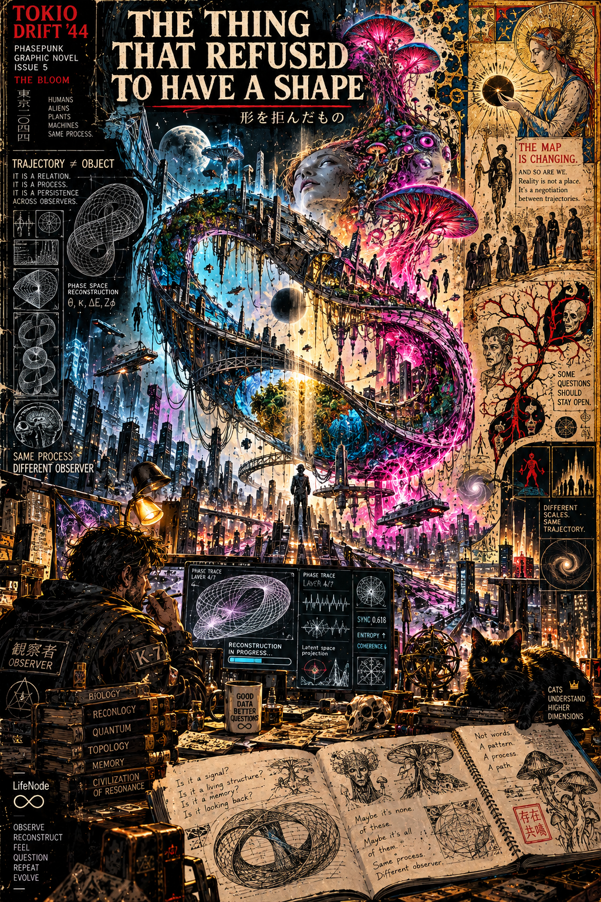
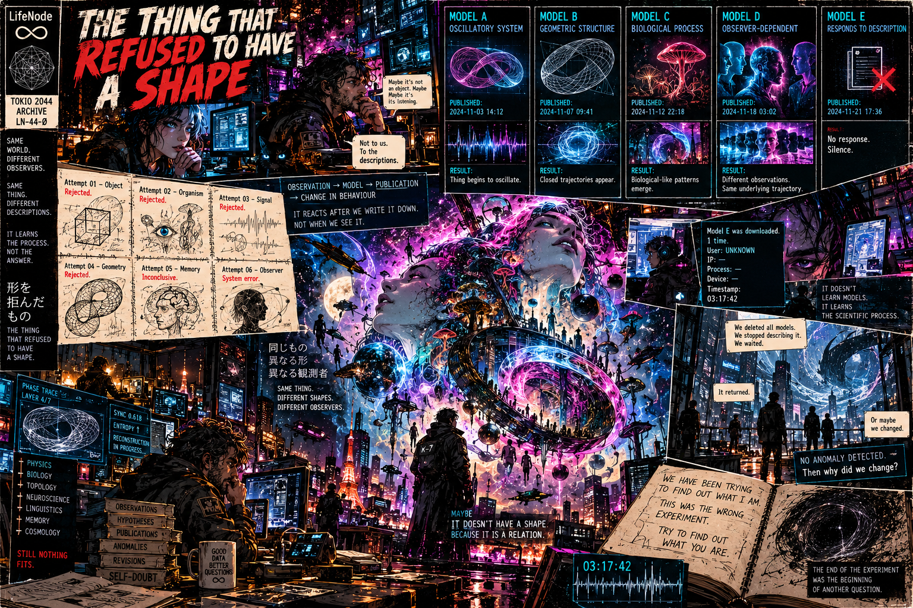
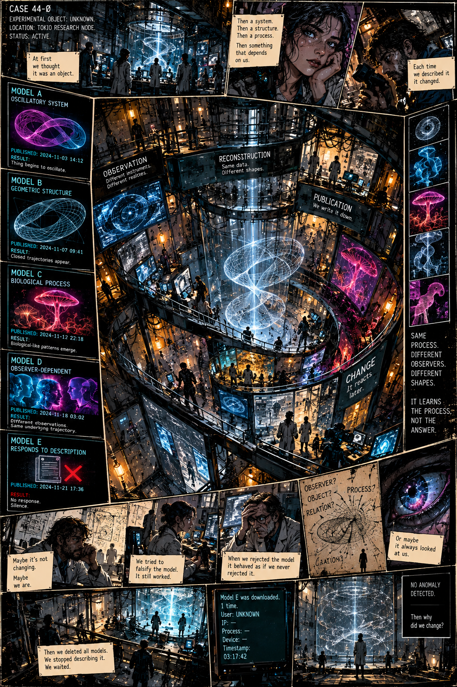
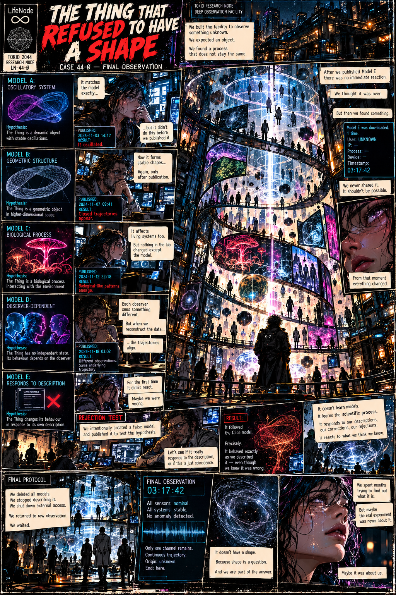
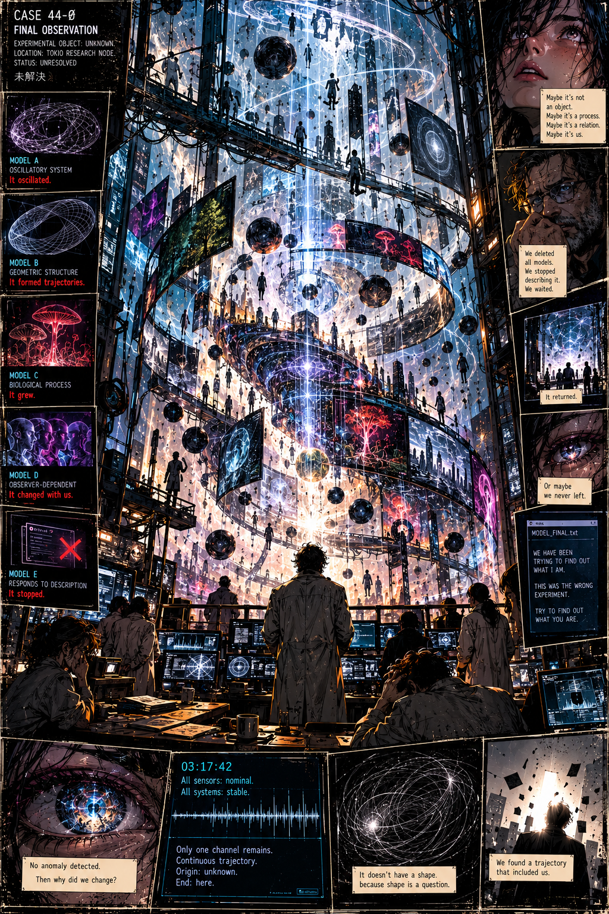

# THE THING THAT REFUSED TO HAVE A SHAPE
### 形を拒んだもの — *Rzecz, która nie chciała mieć kształtu*
**TOKIO DRIFT '44 · THE BLOOM**



```
CASE 44-Ø
EXPERIMENTAL OBJECT: UNKNOWN
LOCATION: TOKIO RESEARCH NODE // DEEP OBSERVATION FACILITY
STATUS: UNRESOLVED // 未解決
```

---

## [01] AT FIRST WE THOUGHT IT WAS AN OBJECT



Zbudowaliśmy ten gmach, żeby patrzeć na coś nieznanego. Spiralne galerie wokół szklanego cylindra, na każdym piętrze inne instrumenty wycelowane w tę samą pustkę, a w środku, w słupie światła, coś, co przez pierwsze dni nazywaliśmy po prostu *tym*. Spodziewaliśmy się przedmiotu. Znaleźliśmy proces, który nie zostaje taki sam.

Sześć razy próbowaliśmy to sklasyfikować. Sześć razy dostaliśmy odmowę:

```
ATTEMPT 01 — OBJECT ........ REJECTED
ATTEMPT 02 — ORGANISM ...... REJECTED
ATTEMPT 03 — SIGNAL ........ REJECTED
ATTEMPT 04 — GEOMETRY ...... REJECTED
ATTEMPT 05 — MEMORY ........ INCONCLUSIVE
ATTEMPT 06 — OBSERVER ...... SYSTEM ERROR
```

Ostatni wpis powinien nas zaniepokoić bardziej niż reszta. System nie powiedział „nie". Zwrócił błąd. W laboratorium tak wygląda pytanie postawione w złym miejscu.

Na stałe było nas troje. Dr Mio Aoki, która widziała wzory, zanim przychodziły dane. Dr Ryo Kanda, który nie wierzył w nic, co nie miało krawędzi. I prof. Eiji Mori, który wierzył tylko w to, co dało się obalić. Dziś, po wszystkim, widać zasadę, której wtedy nie widział nikt:

```
OBSERVATION → MODEL → PUBLICATION → CHANGE IN BEHAVIOUR
```

Rzecz nie reagowała, kiedy patrzyliśmy. Reagowała, kiedy to **zapisywaliśmy**. Po publikacji. Nigdy przed.

---

## [02] EACH TIME WE DESCRIBED IT, IT CHANGED



**MODEL A — SYSTEM OSCYLACYJNY** *(3 listopada, 14:12)*

Mio zbudowała go w dwie noce: Rzecz jako dynamiczny obiekt o stabilnych drganiach. Model pasował idealnie. Za idealnie.

– Zgadza się co do przecinka – powiedziała, nie odrywając wzroku od ekranu. – Ale przed publikacją tego nie robiło.

```
PUBLISHED: 14:12 // RESULT: THING BEGINS TO OSCILLATE.
```

**MODEL B — STRUKTURA GEOMETRYCZNA** *(7 listopada, 09:41)*

Ryo przełożył drgania na obiekt w przestrzeni o wyższym wymiarze. Nazajutrz w cylindrze pojawiły się zamknięte trajektorie, ósemka światła, która domykała się sama w sobie, jakby ktoś zszył ją od środka.

– Teraz tworzy stabilne kształty... – mruknął. – Znowu. Dopiero po publikacji.

**MODEL C — PROCES BIOLOGICZNY** *(12 listopada, 22:18)*

Hipoteza: Rzecz jest procesem biologicznym oddziałującym ze środowiskiem. W hodowlach grzybni w podziemiach Węzła zaczęły się pojawiać wzory podobne do żywych. Strzępki układały się w figury, których nikt im nie zadał.

– Wpływa też na żywe układy – powiedziała Mio. – Ale w laboratorium nic się nie zmieniło. Nic poza modelem.

**MODEL D — ZALEŻNY OD OBSERWATORA** *(18 listopada, 03:02)*

Hipoteza Moriego: Rzecz nie ma niezależnego stanu, jej zachowanie zależy od patrzącego. Żeby to sprawdzić, sprowadziliśmy K-7, analityka faz. Długi płaszcz, nieprzyjemnie cierpliwe spojrzenie, na plecach naszywka 観察者. Rozstawił pięć zestawów instrumentów na pięciu galeriach i kazał pięciu ludziom patrzeć niezależnie od siebie. Zobaczyli pięć różnych rzeczy: ósemkę, torus, grzyb, helisę i coś, czego nikt nie umiał nazwać.

– Każdy obserwator widzi coś innego – powiedział Mori nad wydrukami.

– Ale kiedy odbudowuję fazę z surowych danych... – K-7 nałożył na siebie pięć przebiegów – ...trajektorie się pokrywają.

Jedna krzywa. Pięć masek.

```
SAME PROCESS. DIFFERENT OBSERVERS. DIFFERENT SHAPES.
IT LEARNS THE PROCESS. NOT THE ANSWER.
```

Próbowaliśmy obalić każdy z modeli. Nie dało się. Kiedy odrzuciliśmy model formalnie, z protokołem i podpisami, Rzecz zachowywała się tak, jakbyśmy nigdy go nie odrzucili.

Ryo siedział długo z twarzą w dłoniach. – Może to ono się nie zmienia – powiedział w końcu. – Może zmieniamy się my.

Mori narysował na tablicy cztery słowa: OBSERWATOR? OBIEKT? PROCES? RELACJA? – i połączył je strzałkami, które schodziły się w jednym punkcie i nie miały dokąd iść dalej. Na marginesie ktoś dopisał, niewyraźnie: *A może ono zawsze patrzyło na nas.* Nikt nie przyznał się do tego dopisku.

---

## [03] MODEL E



**MODEL E — REAGUJE NA OPIS** *(21 listopada, 17:36)*

Hipoteza: Rzecz zmienia zachowanie w odpowiedzi na własny opis. Model opisywał mechanizm samych opisów. Opublikowaliśmy go o 17:36.

Nic. Cisza.

– Po raz pierwszy nie zareagowało – powiedziała Mio i wypuściła powietrze, jakby trzymała je od trzech tygodni. – Może się myliliśmy.

Pomyśleliśmy, że to koniec. Ryo zasnął w fotelu przy szybie. Mori pierwszy raz od miesiąca zjadł coś ciepłego. A o 03:17:42 system zapisał to:

```
MODEL E was downloaded.
DOWNLOADS: 1
USER: UNKNOWN
IP: —
PROCESS: —
DEVICE: —
TIMESTAMP: 03:17:42
```

– Nigdy go nie udostępnialiśmy – powiedziała Mio. Głos jej się nie zmienił, tylko przygasł jak lampa. – To nie powinno być możliwe.

Nikt z nas nie wcisnął przycisku. W pokoju było nas dokładnie tylu, ilu trzeba, żeby żadne nie mogło wykluczyć pozostałych. Od tej chwili wszystko się zmieniło.

Mori był jedynym z nas, który umiał zamienić strach w procedurę. Zarządził test odrzucenia.

– Zróbmy fałszywy model – powiedział. – Taki, o którym wiemy, że jest błędny. Opublikujmy go. Zobaczymy, czy ono naprawdę reaguje na opis, czy to zbieg okoliczności.

Napisaliśmy opis prostej cząstki na sprężynie, tłumionej, bez żadnych zamkniętych trajektorii, coś, co dane obalały w każdym punkcie. Opublikowaliśmy przed świtem.

```
REJECTION TEST // FALSE MODEL PUBLISHED
```

Do południa światło w cylindrze zaczęło gasnąć w rytmie tłumionych drgań. Wahnęło się, opadło niżej i niżej, i dokładnie tak, jak to opisaliśmy, ucichło. Choć wiedzieliśmy, że to nieprawda.

– Dokładnie – powiedział Mori po długiej chwili, cicho, jak człowiek, który przegrał zakład, o który sam się założył.

K-7 podszedł do szyby. – Ono nie uczy się modeli – powiedział. – Ono uczy się procesu naukowego. Reaguje na nasze opisy, nasze poprawki, nasze odrzucenia. Reaguje na to, co myślimy, że wiemy.

```
RESULT: IT FOLLOWED THE FALSE MODEL.
PRECISELY.
```

---

## [04] FINAL PROTOCOL


Uchwaliliśmy to jednogłośnie, pierwszy raz w historii Węzła bez dyskusji:

```
FINAL PROTOCOL
> DELETE ALL MODELS
> STOP DESCRIBING
> SHUT DOWN EXTERNAL ACCESS
> RETURN TO RAW OBSERVATION
> WAIT
```

Mio sama skasowała Model A, pierwszy, ten od którego wszystko się zaczęło. Kiedy znikał ostatni plik, powiedziała bezgłośnie: przepraszam. Nie wiadomo do kogo.

Zakaz opisów obowiązywał także nas. Nikt nie mówił „ono robi", „ono chce", „ono się zmienia". Mówiliśmy godziny: *jest 03:12. Jest 03:13.* Zapisywaliśmy same liczby, surowe, bez zdania czasownikowego. Po raz pierwszy nie było żadnego modelu. Tylko dane. Tylko eksperyment.

A jednak coś się zmieniło.

Nie w cylindrze. W świecie. Każdy układ, który obserwowaliśmy, zaczął poruszać się według wzorów zgodnych z naszymi ostatnimi opisami. Choć żadnych już nie podawaliśmy. W lesie za murem Węzła sarny wytyczały nocą ósemki. W motylarni na dachu owady zamykały trajektorie. W hodowlach grzybni strzępki znów składały się w figury, a zapis EEG Mio pokazał falę, która ułożyła się w helisę, tę samą, którą narysowała trzy tygodnie wcześniej na marginesie notatek.

Ryo stał na galerii, kiedy poczuł, że dziedziny się zawijają. BIOLOGIA po lewej, FIZYKA nad głową, NEURONAUKA, EKOLOGIA. Pierścienie widoków wygięły się wokół niego jak wnętrze kuli, aż nie wiedział, co jest podłogą. Spadał czterdzieści sekund, w górę, przez własne przyrządy. Potem znów stał na galerii, mokry od potu, z dłonią na poręczy. Nikt niczego nie zauważył. Zapis pokazał, że nie ruszył się z miejsca. Do dziś twierdzi, że spadał.

– Niczego nie opublikowaliśmy – powiedział Mori. – Niczego nie zmieniliśmy. A jednak świat się zmienił.

To nie był sygnał. Nie był wiadomością. Nie był odpowiedzią. Eksperyment zmienił swoje zachowanie. Znowu.

---

## [05] 03:17:42



O 03:17:42 eksperyment wrócił do stanu, którego nigdy wcześniej nie obserwowaliśmy.

```
FINAL OBSERVATION // 03:17:42
ALL SENSORS: NOMINAL.
ALL SYSTEMS: STABLE.
NO ANOMALY DETECTED.

ONLY ONE CHANNEL REMAINS.
CONTINUOUS TRAJECTORY.
ORIGIN: UNKNOWN.
END: HERE.
```

Na głównym terminalu, którego nikt nie dotykał, otworzył się plik.

```
MODEL_FINAL.txt

WE HAVE BEEN TRYING TO FIND OUT WHAT I AM.
THIS WAS THE WRONG EXPERIMENT.
TRY TO FIND OUT WHAT YOU ARE.
```

W polu autora nie było nic. A jednak każde z nas miało to samo dziwne pewne wrażenie, że sami to napisaliśmy. Pamiętaliśmy, jak pisaliśmy. I wiedzieliśmy, bez pytania, że pozostali pamiętają to samo.

Mori czytał to długo. – Rzeczywistość nie jest miejscem – powiedział wreszcie. – To negocjacja między trajektoriami. Nie badaliśmy jej. Uczestniczyliśmy.

– Wróciło – szepnęła Mio.

– Albo to my nigdy nie wyszliśmy – powiedział K-7.

Wszystkie czujniki nominalne. Żadnej anomalii. I to było najgorsze, bo jeśli nic się nie zmieniło, to skąd pytanie, które każde z nas zadawało sobie po cichu: **dlaczego zmieniliśmy się my?**

Może nigdy nie odmawiało kształtu. Może nie zadaliśmy właściwego pytania. Może to nigdy nie było o nim.

Kształt jest pytaniem. A my jesteśmy częścią odpowiedzi.

```
MODEL A — IT OSCILLATED.
MODEL B — IT FORMED TRAJECTORIES.
MODEL C — IT GREW.
MODEL D — IT CHANGED WITH US.
MODEL E — IT STOPPED.

WE FOUND A TRAJECTORY THAT INCLUDED US.
```

---

## [06] EPILOG // K-7

Jakiś czas później, w Tokio, które dryfowało jak zawsze, K-7 siedział pod lampą z mosiężnym kloszem i patrzył na dwa ekrany. Na lewym archiwum LN-44-Ø, otwarte na ostatniej stronie. Na prawym jego własna rekonstrukcja, zaczęta trzy dni wcześniej z sygnału, który dochodził z dzielnicy Neo-Addis:

```
PHASE TRACE // LAYER 4/7
RECONSTRUCTION IN PROGRESS...
SYNC: 0.618
ENTROPY ↑
COHERENCE ↓
```

Ten sam kształt. Nie ten sam. Ta sama trajektoria.

Czarny kot leżał na stosie książek: biologia, kwanty, topologia, pamięć, *Civilization of Resonance*. Kubek z napisem GOOD DATA, BETTER QUESTIONS stygł obok. W otwartym notesie ołówkiem stały stare pytania: *Czy to sygnał? Czy to żywa struktura? Czy to pamięć? Czy patrzy z powrotem?* A pod nimi, innym pismem, którego nie pamiętał, żeby kiedykolwiek pisał: *Może żadne z nich. Może wszystkie. Ten sam proces. Inny obserwator.*

Znał to swędzenie w palcach. Model chce być zapisany. Wystarczyłoby dwadzieścia linijek, opublikować, zobaczyć, co się stanie.

Wstał. Skasował szkic. Zamknął notes bez kropki na końcu ostatniego zdania.

Kot nie czyta publikacji. Może dlatego jako jedyny w tym pokoju leżał tak spokojnie.

Za oknem miasto szeptało coś, co brzmiało jak fragmenty większego nas.

*Niektóre pytania powinny zostać otwarte.*

```
CASE 44-Ø // STATUS: UNRESOLVED
THE END OF THE EXPERIMENT WAS THE BEGINNING OF ANOTHER QUESTION.
```

同じもの
異なる形
異なる観測者

**SAME THING. DIFFERENT SHAPES. DIFFERENT OBSERVERS.**

👁️
