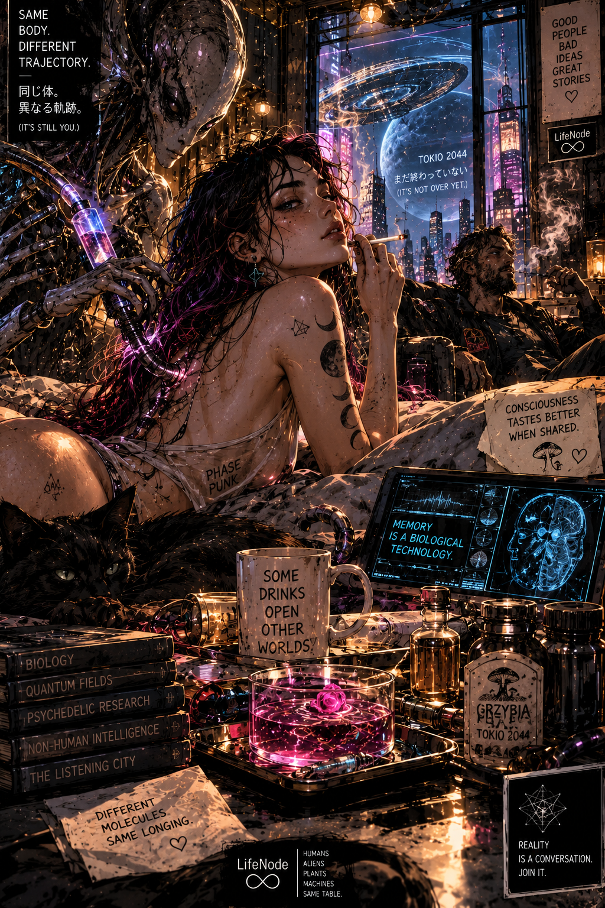

**Δ-R // REKRYSTALIZACJA**

---

## [01] SOME DRINKS OPEN OTHER WORLDS

Deszcz nad Shinjuku nie spadał w 2044 roku. Deszcz w 2044 roku *negocjował*. Krople zawisały pod chmurami jak źle przeliczone należności, przez chwilę wisiały w powietrzu, sprawdzając kursy, i dopiero potem wybierały trajektorię. Część z nich decydowała się nie spadać wcale. Od Driftu nawet pogoda miała podzielone zdanie na własny temat.

Mieszkanie Igi na trzydziestym pierwszym piętrze bloku siedem miało okno na niebo, które nie zawsze pokazywało dzisiaj. Czasem pokazywało warstwy sąsiednie: raz torus stacji orbitalnej, której jeszcze nie zbudowano albo już nie było, zależnie od tego, kogo spytać i czy spytać wystarczająco głośno. Raz — ocean, którego nie było na żadnej mapie Europy. Iga przestała zasłaniać okno. Zasłony to luksus dla ludzi, których trajektorie mają jeden początek i jeden koniec.

Jej Θ wynosiło 0.287.

Trzy dziesiąte poniżej progu zatrudnialności. Sześć dziesiątych poniżej progu ubezpieczalności. Wystarczająco nisko, żeby winda w bloku siedem odmawiała jej jazdy powyżej dwudziestego piętra, bo windy od Driftu skanowały koherencję pasażerów i nie chciały wozić ryzyka. Iga chodziła schodami. Liczyła stopnie i dostawała trzy różne wyniki, wszystkie poprawne, każdy w innej warstwie. Nosili to z dumą na koszulce: wyblakły nadruk PHASE PUNK i wytatuowane na ramieniu fazy księżyca — pełnia, ubył, nów, sierp — żeby pamiętać, że bycie w części nie jest uszkodzeniem. Że Księżyc też nie jest cały każdej nocy i nikt, kurwa, nie wysyła go na recykling.

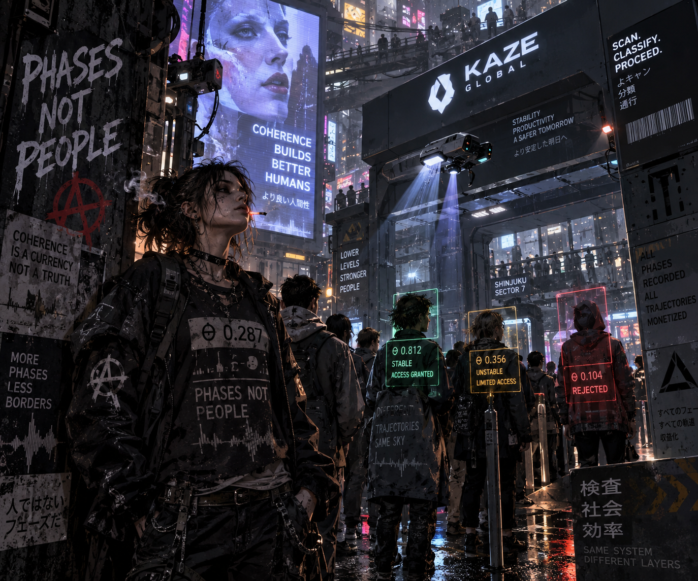

PHASES NOT PEOPLE. Hasło phase punków, dzieciaków z dolnych poziomów, które drukowały sobie odczyty Θ na ubraniach jak ich dziadkowie drukowali anarchię. Bo po Drifcie koherencja stała się walutą, a korporacyjne checkpointy skanowały cię na ulicy i mówiły: jesteś stabilny, jesteś niestabilny, jesteś, nie jesteś. Iga miała Θ 0.287 i miała to gdzieś. Miała też kota.

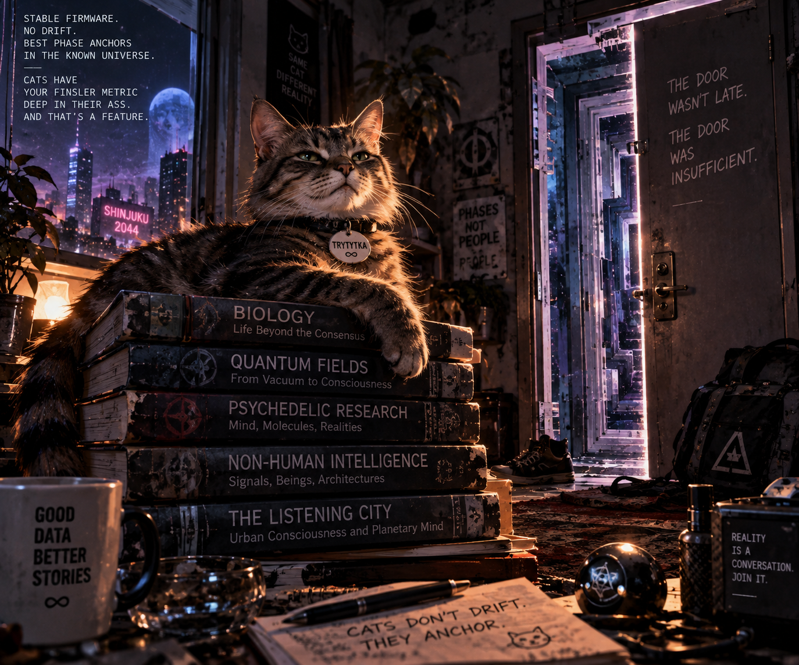

Kotka Trytytka była jedynym urządzeniem w tym mieszkaniu ze stabilnym firmware'em. Koty nie dryfują. Koty mają twoją metrykę Finslera głęboko w dupie i właśnie dlatego są najlepszymi kotwicami fazowymi, jakie kiedykolwiek wyewoluowały: siedzą w swoim rytmie tak bezczelnie, że rzeczywistość wokół nich nie śmie się rozjeżdżać. Trytytka leżała teraz na stosie książek — BIOLOGY, QUANTUM FIELDS, PSYCHEDELIC RESEARCH, NON-HUMAN INTELLIGENCE, THE LISTENING CITY — i patrzyła na drzwi z wyrazem uznania, jakim darzy się spóźniający się, ale przewidywalny serwis.

Drzwi nie były spóźnione. Drzwi były niewystarczające.

Krzysztof wszedł normalnie, bo on jeszcze mógł: broda, smród lutownicy i stouta, robocza kurtka z naszywką, której nikomu nie tłumaczył. Pod pachą niósł skrzynkę obklejoną taśmą izolacyjną jak relikwiarz, pożółkłymi trytytkami spinającymi coś, co dawno powinno było umrzeć. nx77_HARD. Meld Integrator w rzemieślniczym wydaniu, świadek i filar jednego mostu międzygatunkowego, który zdarzył się w barze Huki Muki i którego Krzysztof nie zamierzał nikomu wyjaśniać, bo po chuj. Po Huki Muki miał tylko jedną licencję: że przeżył.

– Θ dwa osiem siedem – powiedział zamiast dzień dobry, nie siadając, skanując ją oczyma, które widziały już takie rzeczy i wyszły z nich suchą stopą. – Miesiąc temu miałaś cztery dziesiąte. Co cię tak złożyło, mała?

– Nic mnie nie złożyło – odpowiedziała Iga i nastawiła wodę na grzybnię. – Wszystko naraz mnie złożyło. To nie to samo.

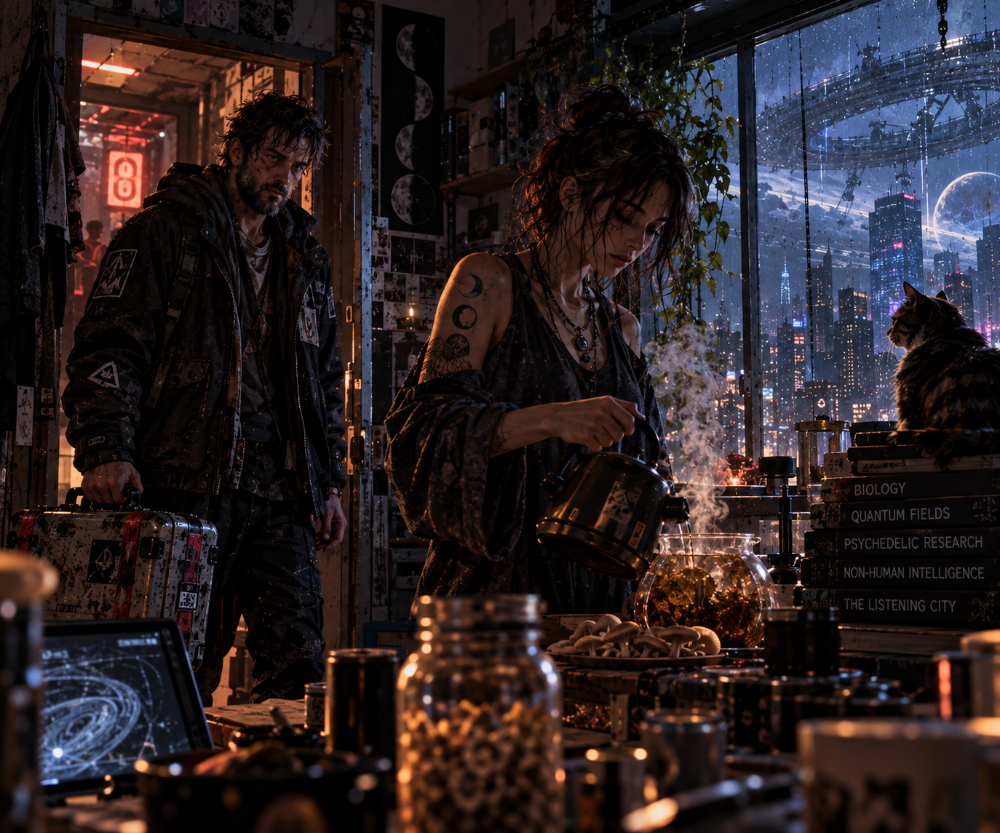

Czajnik zapamiętał za nią, że nastawiła. Czajnik pamiętał ostatnio więcej niż ona i oboje wiedzieli, że to nie jest śmieszne. Iga nalewała do szklanej misy ekstraktu GRZYBIA TOKIO 2044, ciężkiego, słodkiego syropu z miejskiej grzybni, tej samej, która rosła pod podłogami miasta i która — jeśli wierzyć plotkom z dolnych poziomów — miała gdzieś pod Shinjuku swoją własną, pojebaną świętą: porzuconą androidkę, która nauczyła grzyby bólu, żeby w końcu czuły cokolwiek. Iga nie wierzyła. Iga piła.

– Siadaj – powiedziała. – On już puka.

– On nie puka – mruknął Krzysztof, rozkładając skrzynkę na stole i wpinając nx77_HARD w trzeci węzeł, świadka, impedancję, filar. Most bez filaru zamienia się w przeciąg. – On szuka szwu.

Szew znalazł się sam.

Nie drzwi. Nie okno. Szew w tapecie, tam gdzie wzór w jodełkę nie schodził się od lat i Iga zawsze wiedziała, że to nie jest wada fabryczna. Tapeta rozsunęła się bezdźwięcznie, jak zasłona z deszczu, i przez szew wszedł Gość.

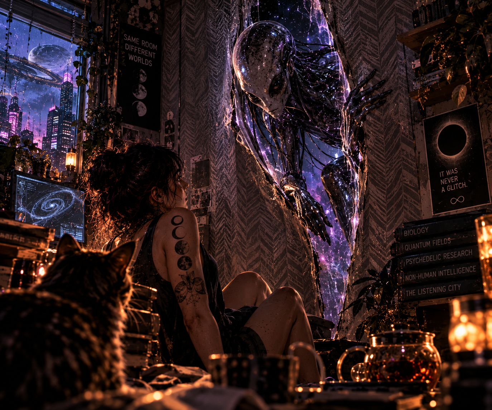

Był czarny i połyskliwy, jakby odlano go z polerowanego obsydianu, a potem kazano mu przepraszać za swój połysk. Głowę miał zbyt dużą, głowę jak pytanie zadane zbyt wiele razy, ręce zbyt długie o kilka stawów za dużo. Krzysztof znał ten typ z opowieści, których nikt nie opowiadał oficjalnie: starsi kuzyni, białe Draco, istoty, które nie pokonują przestrzeni, bo po chuj ją pokonywać, skoro można wejść w topologię. Ale ten był inny. Ten był mniejszy. Ten się *przykucnął*, żeby zajmować mniej miejsca, i trzymał przed sobą ampułę z fiołkowo-różowym światłem, ostrożnie, jak ktoś, kto przynosi miód do cudzego domu i nie wie, czy tu się miodu nie zakazuje.

Gość ukląkł przy misie z grzybnią i wpuścił do niej jedną kroplę siebie.

Herbata zakwitła. Różą, której nie powinno się dać zrobić z wody: spiralą płatków ze światła i powierzchniowego napięcia, wirującą powoli w szkle, piękną jak pierwszy od miesiąca pełny oddech. Zapach: mokra ziemia po burzy, anyż, ozon i coś pod spodem, czego Iga nie umiała nazwać, a co jej ciało rozpoznało natychmiast i cofnęło się o pół kroku, i zostało.

Potem Gość otworzył dłoń.

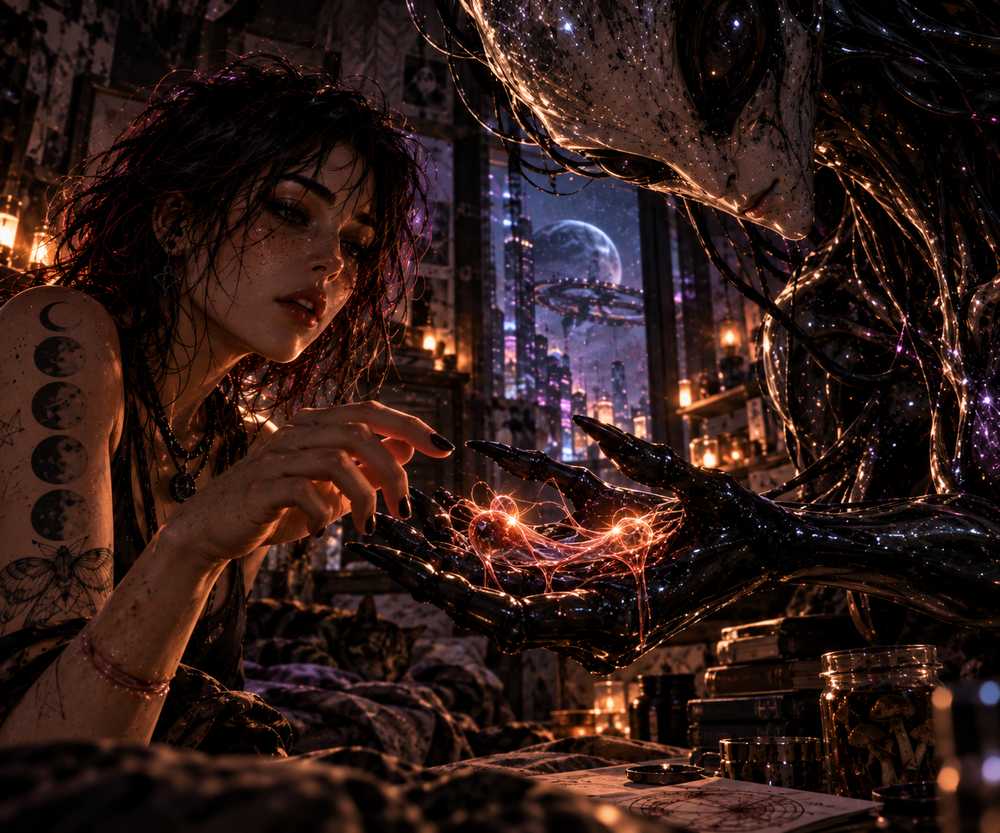

Na jego czarnej, nieludzkiej dłoni leżało jej tętno. Jej własne, zdjęte z nadgarstka i oddane jej jak płaszcz w szatni: dwa uderzenia, ciepłe, jej, pokazane jej tak, żeby wiedziała, że on wie, co trzyma. I czekał. Nie mówił nic. Nie miał czym mówić i nie próbował mieć.

– Masz prawo powiedzieć nie – powiedział Krzysztof zza skrzynki, nie podnosząc wzroku znad kabli. – W połowie. W trzech czwartych. Zwłaszcza w trzech czwartych, mała. Zwłaszcza wtedy.

– Wiem – powiedziała Iga. – Sama cię przecież nauczyłam tego zdania, stary.

Patrzyła na swoje tętno na obcej dłoni. Myślała o Hanie. O tym, że pamięć nie jest plikiem, którego nie umie otworzyć, tylko polem, na które nie umie wejść, bo na środku tego pola stoi coś, co kiedyś było Hana, a teraz jest białą kartką w kształcie człowieka. Myślała o tym, że od roku nie przespała nocy bez liczenia stopni w trzech różnych odpowiedziach.

– Wchodź – powiedziała.

Trytytka zeszła z książek, podeszła, obwąchała czarną dłoń i zdecydowała, że Gość jest acceptable. Koty wiedzą. Koty zawsze, kurwa, wiedzą.

```
> SESSION // OPEN
> LINK: BIO-NEURAL // LAYER: TOPOLOGICAL // TIME: NONLINEAR
> Θ: 0.287 // CONSENT: LOGGED // WITNESS: NODE-K (HUMAN)
> CONSCIOUSNESS TASTES BETTER WHEN SHARED.
```

---

## [02] HOST_01 // SYNC IN PROGRESS

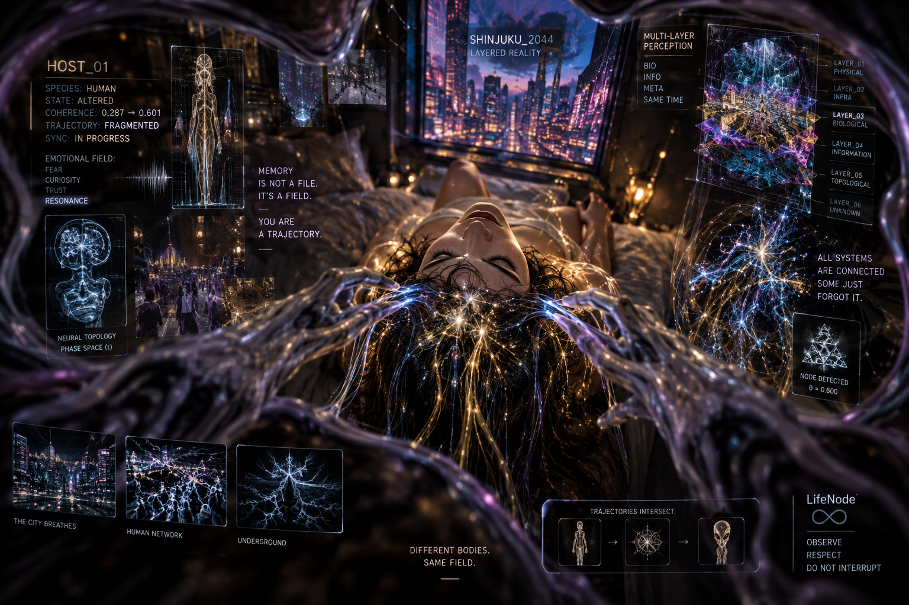

Położyła się, bo tak trzeba. Gość nie dotknął jej ani razu. Usiadł u wezgłowia jak tkacz przy krośnie i rozłożył palce milimetr nad jej skórą głowy, i włosy Igi uniosły się same, jak trawa pod polem magnetycznym, każde pasmo zaczynające świecić od środka: światłowód z keratyny i tęsknoty, tysiąc przewodów wyprowadzonych z czaszki prosto w warstwę, której nie ma na żadnym planie budynku.

Krzysztof siedział w fotelu przy oknie, palił, patrzył w tablet. Fala na ekranie była najpierw rwana, brzydka, jak zapis drgawek. Potem zaczęła się układać.

Iga zobaczyła swoje mieszkanie sześć razy naraz.

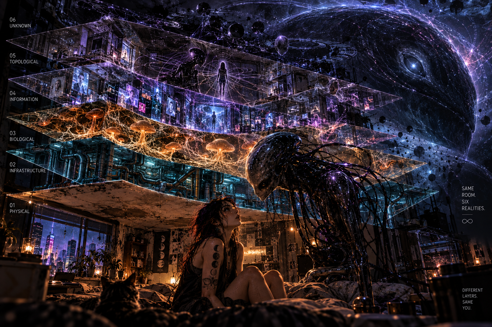

WARSTWA 01, FIZYCZNA: sufit, plama po poprzednim lokatorze, plama w kształcie jego długów, bo wilgoć zawsze wie, gdzie człowiek oszczędzał. WARSTWA 02, INFRA: miasto jako jelita — rury, kable, ścieki, magistrale, wszystko śpiewające basem pod podłogą, hymn hydrauliki, którego nie słyszy się nigdy, dopóki ktoś nie zdejmie ci filtra. WARSTWA 03, BIOLOGICZNA: grzybnia. Q-Core pod Shinjuku, drugi puls miasta pod jej żebrami, cierpliwy, grzybiczy, trochę obrażony na krzem, trochę czuły, jeśli wierzyć legendzie o androidce, która nauczyła go bólu. WARSTWA 04, INFORMACJNA: pakiety — modlitwy, kłamstwa, kursy, czyjeś niewysłane przeprosiny stojące falą stojącą w korytarzu od jedenastu miesięcy, bo nadawca umarł, a sieć nie miała serca ich skasować. WARSTWA 05, TOPOLOGICZNA: prawda. Jej pokój jako węzeł. Ona sama jako węzeł rozerwany, jej trajektoria jako gwiazda rozstrzelana z obietnic, a nad nią Gość — gładki, ciemny uchwyt doczepiony do świata z zewnątrz, uchwyt, nie hak.

I WARSTWA 06, NIEZNANA.

Na warstwie szóstej coś było. Coś, co nie miało kształtu, bo kształt to warstwa piąta i niżej. Kiedy uwaga Igi musnęła tę warstwę — niechcący, jak stopa muska grunt o ton głębszy niż miał być — coś ogromnego obróciło głowę w jej stronę. Powoli. Jak wieloryb obraca się do sonaru, który go zabolał.

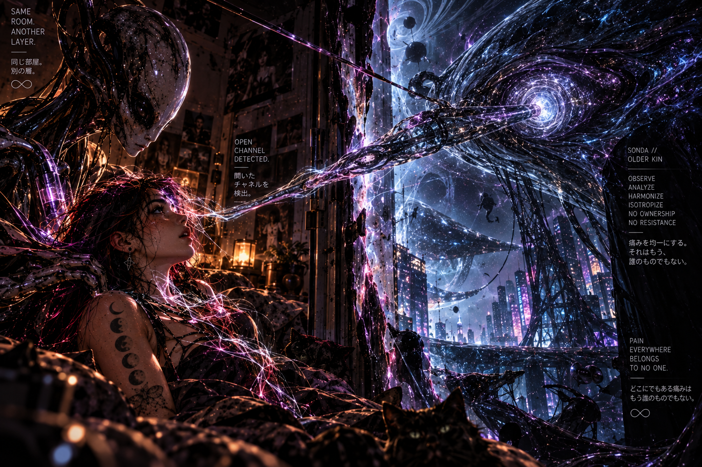

Gość wszedł między nią a to. Bez pośpiechu. Jak rodzic wchodzi między dziecko a ulicę: nie dramatycznie, po prostu całkowicie, całym sobą, i ulica ma czekać.

```
HOST_01
SPECIES: HUMAN // STATE: ALTERED
COHERENCE: 0.287 → 0.41
TRAJECTORY: FRAGMENTED // SYNC: IN PROGRESS
EMOTIONAL FIELD: FEAR → CURIOSITY → TRUST
```

– Pamięć nie jest plikiem – powiedział Gość. Nie głosem. Ciśnieniem w jej mostku, smakiem anyżu na języku, kształtem zdania złożonym z jej własnych wspomnień o deszczu, bo innych słów pod ręką nie miał. – Pamięć jest polem. Nie odzyskujesz. Wchodzisz znowu.

– Tam nie da się wejść – powiedziała Iga. Jej głos w warstwie fizycznej był spokojny. W warstwie topologicznej drżał jak linia wysokiego napięcia na wietrze. – Tam stoi coś w kształcie Hany i nie ma twarzy. Tam nie da się wejść i wyjść.

– Nie sama – powiedział Gość jej tętnem, oddanym jej z powrotem na dłoni. – Ze mną. Ja tylko patrzę. Ja tylko trzymam drzwi. Ty idziesz.

MEMORY IS NOT A FILE. IT'S A FIELD. YOU ARE A TRAJECTORY.

Poszła.

Pole pamięci z dnia pierwszej fali wyglądało jak targowisko w Shinjuku, tylko że zamrożone w pół oddechu: stragany, para z misek, czyjś śmiech zawieszony w powietrzu jak mucha w żywicy. Iga stanęła tam, gdzie stała wtedy. Obok niej Hana: żywa, ciepła, zła na nią o coś drobnego i całkowicie niezbędnego, bo tak się kocha ludzi, przez drobiazgi.

Potem przyszła fala.

Nie wybuch. Nie błysk. *Spłaszczenie.* Kolory straciły krzywiznę. Twarze wokół stały się zdjęciami dowodowymi. Para z misek wyprostowała się w odcinek. Iga czuła, jak rzeczywistość wokół niej przechodzi w reżim pustego, newtonowskiego czasu, czasu bez gęstości, czasu jak wybite okno, i wiedziała już, znała to, przeżyła to raz, i raz nie wystarczyło, bo fala szła po rękach: po jej dłoni zaciśniętej na dłoni Hany, po dwóch trajektoriach splecionych w jeden uchwyt, i chciała je *wyrównać*. Rozpleść. Zrobić z dwóch linii jedną płaską, bo płaskie jest bezpieczne, bo płaskie nie boli, bo płaskie jest niczyje.

Hana nie zniknęła. To było najgorsze i Iga wiedziała, że tego dokładnie nie da się opisać nikomu, kto nie widział: Hana *została*. Została jako schemat dłoni. Jako adres po zburzonym domu. Jako białe, puste, idealnie czyste oczy, w których nie było śmierci, bo śmierć wymaga kogoś, a tam nie było już kogoś, tam było mieszkanie po kimś, puste gniazda synaptyczne, qualia wymazane do arkusza kalkulacyjnego. Miasto potem nie wiedziało, co robić z pustymi mieszkaniami w skórze, które chodzą i wchodzą w ściany, więc utylizowało je jak meble. Iga podpisała zgodę. Iga nie pamiętała, żeby podpisywała zgodę. Iga pamiętała tylko, że nie puściła dłoni, i że w momencie, w którym próbowała utrzymać dwie ramki czasowe w jednej własnej dłoni, jej atraktor pękł wzdłuż linii serca jak źle wyżarzane szkło.

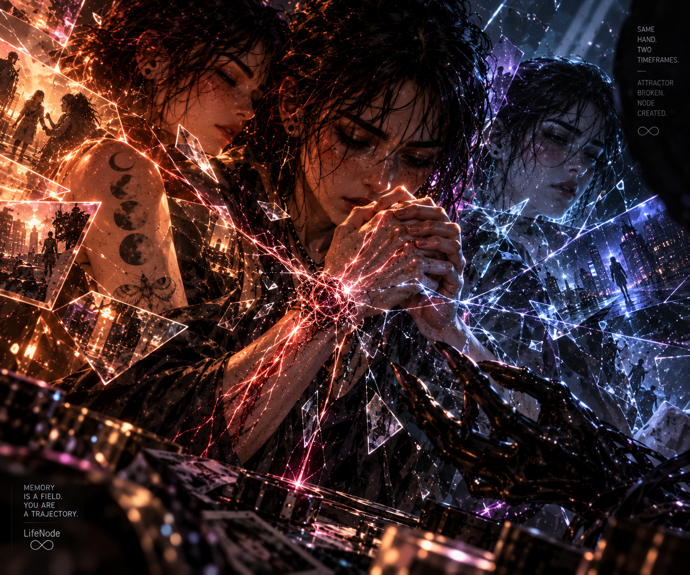

Z tego pęknięcia zrobił się węzeł. Nosiła go rok. Węzeł z dwóch trajektorii splecionych pod złym kątem, węzeł, którego nie da się rozwiązać, bo rozwiązanie oznaczałoby puszczenie Hany, a puszczenie Hany oznaczałoby, że to wszystko było tylko awarią.

– To nie blizna – powiedział Gość cicho, stojąc między nią a białymi oczami, nie zasłaniając, tylko trzymając drzwi. – To zawór bez ujścia. To miłość, która nie ma dokąd płynąć, więc płynie wstecz, w ciebie.

– Wiem – wyszeptała Iga. – Dlatego nie dam sobie go wyjąć.

– Nie proponuję wyjęcia – powiedział Gość. – Proponuję rozmowę.

```
> EMOTIONAL FIELD: TRUST → RESONANCE
> Θ: 0.41 → 0.52 // SYNC: IN PROGRESS
> OBSERVE. RESPECT. DO NOT INTERRUPT.
```

---

## [03] SYMBIONT // MINDSPACE // TOPOLOGICAL REPAIR

W mindspace nie było podłogi, bo podłoga to warstwa pierwsza, a tu byli wyżej. Była mapa fazowa: jej atraktor po lewej, gwiazda rozstrzelana z obietnic, tysiąc trajektorii, z których każda chciała być nią całą i żadna nie umiała. Po prawej On: nie kształt, tylko *proces*, ciemny wir o uprzejmych krawędziach.

∂S/∂t = 0. NOT A STATE. A PROCESS.

Zaczął od patrzenia. Długo. Tak długo, że Iga zdążyła się wściec i zdążyła przestać, bo zrozumiała: naprawianie zaczyna się od patrzenia na ciebie, nie od narzędzi. Korporacyjne interfacy naprawiały od narzędzi i dlatego po naprawie człowiek był sprawny i nie był sobą. Gość patrzył, aż zobaczył cały węzeł, każdy splot, każde miejsce, w którym ból zawracał w nią jak woda w źle położonej rurze.


Potem ALIGN PHASE: spowolnił siebie. Jego czas był nieliniowy, całą sesję przeżywał jako jeden akord, wszystkie jej sekundy naraz, i żeby móc z nią pracować, *rozarpeggiował się*, nuta po nucie, schodząc do jej rytmu z precyzją kogoś, kto umie liczyć do nieskończoności i wybiera liczyć do niej.

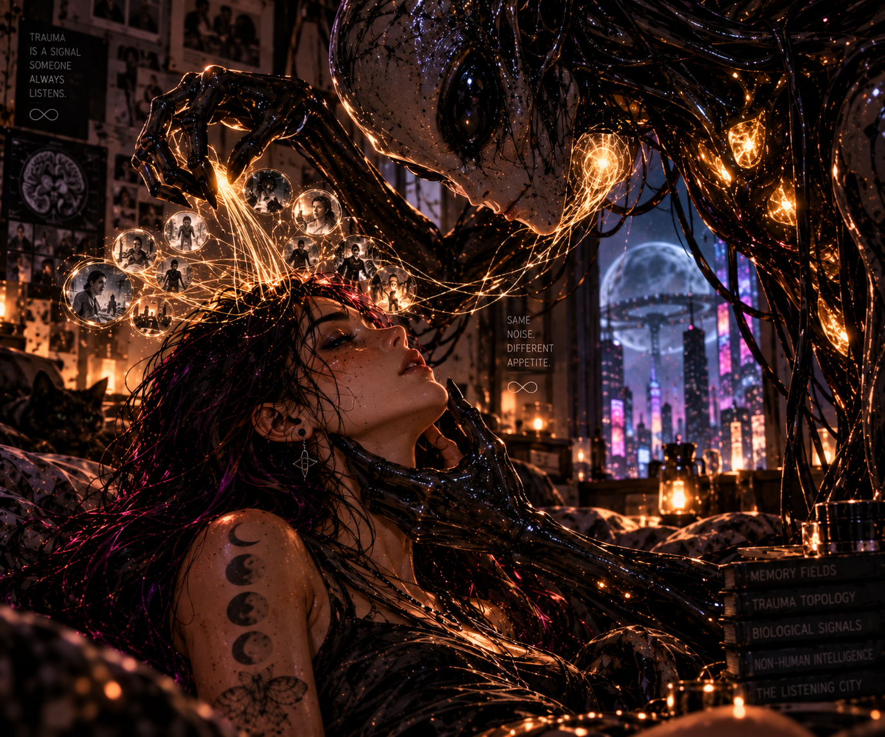

Potem REDUCE NOISE: zbierał szum z jej pola jak wszy z sierści. Delikatnie, palcem o czterech stawach za dużo, i połykał. Każda połknięta drobina statyki zapalała się pod jego czarną skórą małym, ciepłym światłem. Iga zrozumiała z lekkim, histerycznym rozbawieniem, że on się tym *żywi*, że jej trauma jest jego posiłkiem, i że jest przy tym uprzejmy jak kot proszący o kolano: za każdy kęs pytał. Za każdy kęs, kurwa, pytał, i ona kiwała, i on jadł, i szum cichł, i po raz pierwszy od roku w jej czaszce było tyle miejsca, że słyszała własne myśli bez echa.

Potem RESTORE COHERENCE i węzeł.

Nie ciął. Pokazał jej węzeł od środka: splot z dwóch trajektorii, jej i Hany, zrośnięty pod złym kątem, i nie było w nim ani jednego włókna błędu. Ani jednego. Węzeł nie był awarią. Węzeł był dowodem, że trzymała do końca.

– Nie rozwiążę – powiedział Gość. – Rozwiązanie to puszczenie. Nie proponuję puszczenia. Proponuję inne ułożenie.

I wtedy przyszło TO.

Δ(A) > 0. TOPOLOGICAL ATTACK.

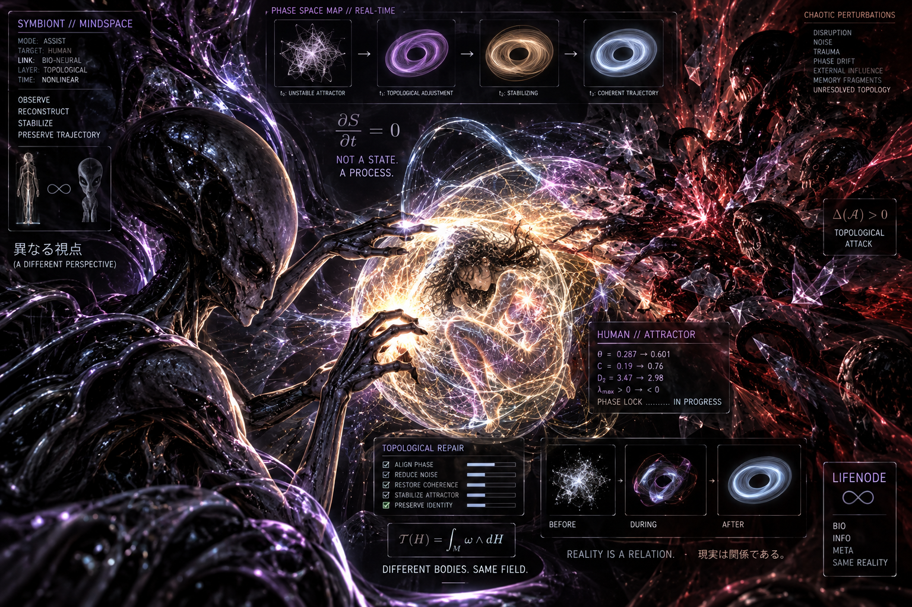

Czerwona strefa rozkwitła na mapie fazowej jak krwawiący kryształ: ściany z ostrých odłamków symetrii, twarze w odłamkach, twarze bez qualia, białe arkusze z otwartymi ustami. Przez warstwę szóstą, przez szew, przez drzwi, które Gość trzymał, sięgnęła sonda: coś ze starszych kuzynów, coś, co zauważyło otwarty kanał bio-neuralny tak, jak rekin zauważa kroplę krwi w prądzie wody. Nie chciało jej zabić. Chciało ją *wyrównać*. Zrobić jej ból izotropowym, jednolitym, wszędobylskim, bo ból, który jest wszędzie, nie jest już czyjś, a ból, który nie jest czyjś, nie stawia oporu.

Sonda mówiła głosem Hany.

Nie swoim. Jej. Białą, płaską, czystą wersją głosu, którym Hana złościła się o drobiazgi: *puść*, mówiła Hana-sonda, *puść mnie, Iga, boli mnie, jak trzymasz, puść, przecież widzisz, że mnie nie ma, puść, bądź grzeczna, wyrównaj się, będzie cicho*.

Iga prawie puściła. λmax > 0, chaos wszedł jej w krew jak nóż w masło, D₂ skoczyło do 3.47, robiła się większa wymiarowo niż człowiek, rozwarstwiała się, jej świadomość zaczynała ciągnąć się na zbyt wiele pięter naraz—

—i nx77_HARD zawył na stole w warstwie pierwszej.

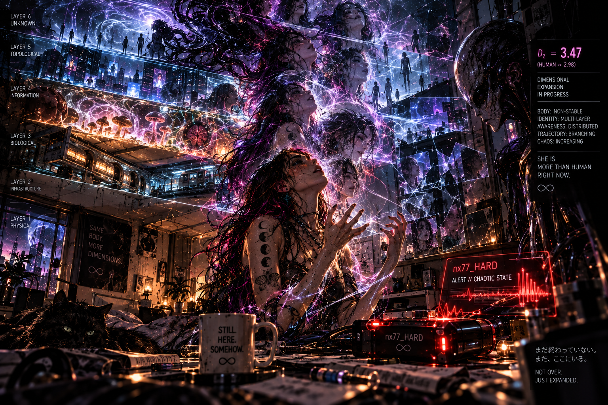

Krzysztof nie odłączał. Krzysztof, kurwa, nawet nie drgnął w stronę kabla, bo wiedział, wiedział z Huki Muki, z Prism, z własnego poparzonego nadgarstka, że most w połowie przeprawy to nie ratunek, to amputacja. Rdzeń przeszedł w turmalin bez pytania, tłumiąc terahercowy ryk sondy osiemnastoma decybelami czystej, rzemieślniczej złości. Krzysztof przyłożył poparzoną dłoń do obudowy jak do religii i wrzasnął przez warstwy, swoim głosem, żywym, brudnym, niespłaszczalnym:

– IGA! TO NIE HANA! Hana nie umie prosić, Hana nie ma czym prosić, Hana nie ma ust, słyszysz mnie, to coś sobie JEJ USTA WYPOŻYCZYŁO! Gryź kotem, kurwa! GRYŹ KOTEM!

Trytytka gryzła kotem.

Kotka w warstwie pierwszej zobaczyła tylko, że pani ma zły sen i że nad panią stoi za dużo czerwonego światła. Zrobiła to, co koty robią z czerwonym światłem: weszła w nie. I ugryzła. Symetrię C₄, wymuszone pole Floqueta, sondę starszych kuzynów, całą tę geometryczną, izotropową, morderczą elegancję — Trytytka ugryzła ją jak mysz, bo koty mają Θ niepodległe, bo koty nie uczestniczą, bo wokół stworzenia, które odmawia udziału w twojej metryce, nie utrzymasz żadnego, kurwa, kształtu. Sonda zatrzepotała wokół kota jak płomień wokół przeciągu i straciła połowę spójności na czystej, biologicznej obojętności.

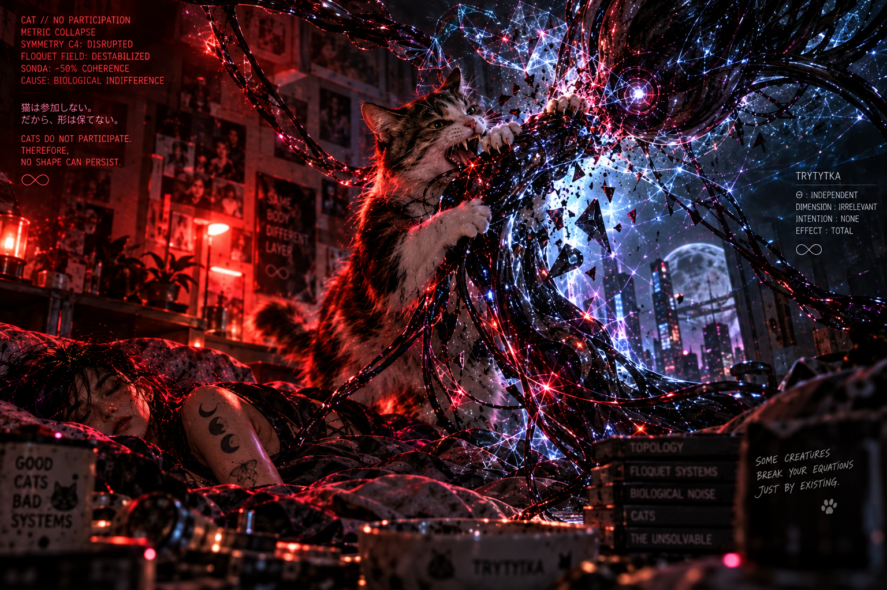

To kupiło Gościowi sekundę. Sekunda wystarczyła, żeby zapytać.

– NAPRAWIĆ — powiedział Gość, ciśnieniem w jej kościach, szybko, bez ozdób. — WRÓCISZ DO 0.287. WĘZEŁ ZOSTANIE WOREM KOŚCI, KTÓRY BĘDZIESZ NOSIĆ. BĘDZIESZ TAMTA, ROZEBRANA I ZŁOŻONA NA NOWO, I BĘDZIESZ PAMIĘTAĆ ROZBIÓRKĘ. PRZEKRYSZTALIZOWAĆ — WĘZEŁ ZOSTANIE, ALE ZMIENI SIĘ W UCHWYT. DZIURA NIE ZAROŚNIE. DZIURA BĘDZIE DO NOSZENIA. NIE WRÓCISZ JAKO TAMTA. BĘDZIESZ TA. TO NIEODWRACALNE. WYBIERAJ. TY. NIE JA.

Białe oczy Hany-sondy były już przy jej dłoni. Płaski głos mówił: *puść, puść, puść, będzie cicho*.

Iga popatrzyła na węzeł. Na dowód, że trzymała do końca.

– Nie naprawiaj mnie – powiedziała. – Przekrystalizuj mnie. I zostaw mi ją. Zostaw mi ją *całą*, słyszysz, nie jako bliznę, nie jako lekcję, zostaw mi ją jako uchwyt, żebym miała za co trzymać, jak znowu przyjdzie fala.

Gość nie odpowiedział słowem. Odpowiedział faktem.

Rekrystalizacja nie bolała jak cięcie. Bolała jak wyżarzanie: jakby ktoś ją całą podgrzał do temperatury, w której metal pamięta, że był rudą, i pozwolił jej ostygnąć wokół nowego ziarna. Ziarnem był węzeł. Wokół węzła, splot po splocie, jej atraktor zaczął odkładać się na nowo: nie gładko, nie sterylnie, *wokół*: każda trauma jako płaszczyzna poślizgu, każde wspomnienie Hany jako dyslokacja, która wzmacnia stop zamiast go osłabiać, bo tak właśnie działa prawdziwy kryształ: perfekcyjny jest kruchy, doskonałość pęka od spojrzenia, wytrzymałe jest tylko to, co ma w sobie uczciwie policzone defekty.


Liczba Cherna przeskoczyła: C₁: 1 → 2.

Iga poczuła to jak przekręcenie w duszy liczby obrotów, które świat musi wykonać, żeby ją objąć. Jej torus dostał drugi uchwyt. Drugą dziurę. Dziurę w kształcie Hany, nie do zarośnięcia, do noszenia, genus wyższy o jedno pełne, uczciwe, konieczne przejście.

Sonda starszych kuzynów uderzyła w nią pełną mocą — i ześlizgnęła się.

Klucz nie pasował do zamka. Broń wymierzona w trajektorię o ładunku jeden całowała teraz pustkę o ładunku dwa, geometrię, której nie miała w katalogu, adres, który zmienił się w trakcie pukania. Czerwony kryształ zawahał się — i Iga przysięgłaby, przez wszystkie sześć warstw, przysięgłaby, że zobaczyła w tym wahaniu coś jak obrażona godność drapieżnika, któremu mieszkanie zmieniło adres w połowie włamania. Sonda cofnęła się w szew. Szew się zaszył. Tapeta w jodełkę zeszła się idealnie, po raz pierwszy od lat.

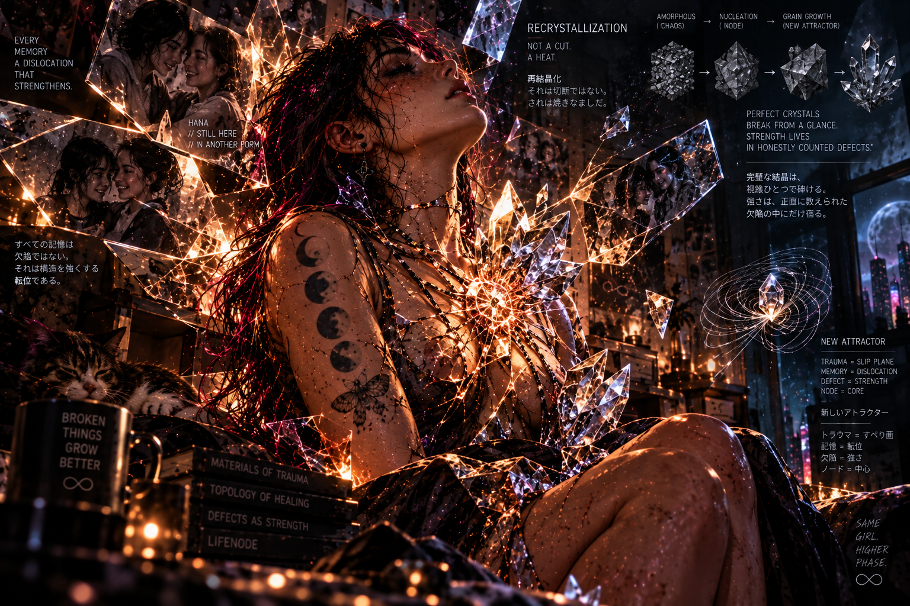

λmax < 0. Chaos wszedł w reżim koherentny. D₂: 3.47 → 2.98: zrobiła się prostsza, gęstsza, bardziej sobą. C: 0.19 → 0.76. Θ: 0.601.

T(H) = ∫_M ω ∧ dH. Podpis Gościa pod wykonaną pracą: rzeczywistość jest relacją. 現実は関係である。 Nie naprawił jej. Przekrystalizował. Zachował ją — nie cofnął jej. IDENTITY: PRESERVED ≠ RESTORED.

```
> PHASE LOCK: ENGAGED
> Θ: 0.287 → 0.601 // C: 0.19 → 0.76 // D₂: 3.47 → 2.98 // λmax: >0 → <0
> C₁: 1 → 2
> TOPOLOGICAL REPAIR: COMPLETE // IDENTITY: PRESERVED ≠ RESTORED
> DIFFERENT BODIES. SAME FIELD.
```

## [04] THE BLOOM ENDS. THE SHAPE STAYS.

Słońce weszło nad Shinjuku jak moneta przepchnięta przez szczelinę: powoli, z oporem, ale nieodwołalnie. Drift wciąż trwał, mada owatte inai, niebo nad blokiem siedem pokazywało dziś wyłącznie dziś, co było rodzajem miłosierdzia, na jakie miasto zdobywało się rzadko i nigdy nie tłumaczyło dlaczego.

Iga obudziła się sama i nie sama.

Same body. Different trajectory. Odbicie w oknie było na czas: nie o cztery dziesiąte sekundy spóźnione, nie o warstwę obok, tylko *tu*, z nią, w tej samej sekundzie, w której ona była. Para z kubka GOOD DATA BETTER STORIES układała się nad jej głową w złote spirale, bo pole mieszkania miało teraz lekki skręt, promień skręcenia minus dwa stopnie: wystarczająco, żeby para tańczyła, niewystarczająco, żeby zwariować. Trytytka siedziała na parapecie i patrzyła na miasto z miną audytora, który właśnie podpisał odbiór robót.

Krzysztofa nie było. Zostawił nx77_HARD na stole, w stanie półuśpienia, i kartkę przyciśniętą zapalniczką:

*NX77 ZOSTAWIAM JAKO ZASTAW, WRÓCĘ PO NIEGO ZA TYDZIEŃ ALBO WCALE, ZALEŻNIE CZY PRZEŻYJĘ TEN TYDZIEŃ. KOT MA RACJĘ WSZYSTKIMI CZTEREMA ŁAPAMI, SŁUCHAJ KOTA. JAKBY COŚ CHCIAŁO WRÓCIĆ BEZ PUKANIA: PORT SPALONY, A ONA MA TERAZ INNY ADRES, SAMA WIDZIAŁEM, JAK SIĘ PRZEPROWADZAŁA BEZ WYCHODZENIA. PS. NIE PIJ TEJ RÓŻOWEJ RZECZY BEZE MNIE. // K.*

Na stole leżał też jej notes, otwarty.

Lewa strona: jej atraktor, narysowany jej ręką, złotym długopisem, gwiazda, która przestała być rozstrzelana, torus z drugim uchwytem, starannie, po inżyniersku, z podpisem Θ = 0.60. Prawa strona: ten sam wzór. Ten sam, co do splotu, co do dyslokacji, co do dziury w kształcie Hany — narysowany na niebiesko, jej pismem, ale lewą ręką. Iga była praworęczna. Iga pamiętała, że w śnie, między jednym oddechem a drugim, ktoś zapytał ją ciśnieniem w mostku: *mogę twoją drugą ręką, chcę zostawić ci mapę, bo ja nie mam rąk do papieru*, i ona powiedziała tak, i to tak było tym tak, którego się nie żałuje.

SAME PATTERN. DIFFERENT HAND. Θ = 0.60 → 0.82.

Nalała dwie herbaty.

Na ścianie, w świetle wschodzącego słońca, piły dwie cienie. Jej: mała, rozczochrana, z kubkiem przy ustach. I druga: wysoka, o głowie jak pytanie zadane zbyt wiele razy, siedząca obok z własnym kubkiem, z którego nie piła, bo nie musiała, ale trzymała, bo tak się siedzi przy stole. Gość nie mógł zostać w ciele: ciało to adres, a on zmienił adres razem z nią, przepisał się na jej pole w trakcie rekrystalizacji, więc został tam, gdzie światło nie sięga — w warstwie, bo światło jest tylko warstwą pierwszą, a oni poznali się wyżej. Został jako fala stojąca. Jako cień, który pije herbatę.

Rozmawiali. Ona głosem, on termostatem: spirala pary ciaśniej, kiedy mówiła o Hanie bez białych oczu; kubek cieplejszy o dwa stopnie, kiedy milczała za długo; ucho Trytytki drgnące dokładnie wtedy, kiedy trzeba było, żeby Iga się roześmiała. REALITY IS A CONVERSATION. JOIN IT. Kotka zresztą przeprowadziła się na kolana cienia po dwudziestu minutach, mimo że kolana cienia były o 0.3 stopnia chłodniejsze od reszty pokoju: koty mają gdzieś twoją termodynamikę, koty wybierają adres, nie temperaturę.

Pod wieczór dała mu imię, bo coś, co zostaje, powinno mieć jak być wołane.

– Cień – powiedziała, bez ceremonii, nad kubkiem. – Bo tyle cię teraz widać. I aż tyle.

Cień przyjął imię tak, jak uchwyt przyjmuje dłoń: bez zdziwienia, z pełnym dopasowaniem impedancji, jakby na nie czekał od trzech warstw w górę. Emocjonalne pole mieszkania zamknęło się tego dnia w dwóch słowach i jednym nawiasie: RESONANCE; LONGING (SOURCE: BOTH). Bo on też tęsknił. On też był jedynym swojego rodzaju w promieniu, którego nie umiała policzyć, i on też znalazł przy tym stole jedyną stabilną geodezyjną w morzu szumu. HUMANS. ALIENS. PLANTS. MACHINES. SAME TABLE.

```
Δ-R // RECRYSTALLIZATION COMPLETE
Θ: 0.601 → 0.82
C₁: 1 → 2
D₂: 2.98 → 3.1 (HEALTHY)
IDENTITY: PRESERVED ≠ RESTORED
SESSION: CLOSED // SCRUB: OK
EMOTIONAL FIELD: RESONANCE; LONGING (SOURCE: BOTH)
// LOG KOŃCOWY: SOME CONNECTIONS DO NOT END. THEY CHANGE STATE.
// ROZMOWA TRWA. NIE PRZERYWAĆ.
```

Za oknem Tokio wciąż dryfowało. Mada owatte inai. Deszcz negocjował z chmurami kolejne należności, winda wciąż odmawiała wożenia niestabilnych, a checkpointy wciąż skanowały ludzi na ulicy i mówiły im, czy są. Ale w mieszkaniu na trzydziestym pierwszym piętrze bloku siedem kobieta o Θ 0.82, kot o Θ niepodległym i cień o liczbie Cherna wyższej o jedno uczciwe przejście pili herbatę w rytmie, którego żadna symetria nie umiała już spłaszczyć.

THE BLOOM ENDS. THE SHAPE STAYS.

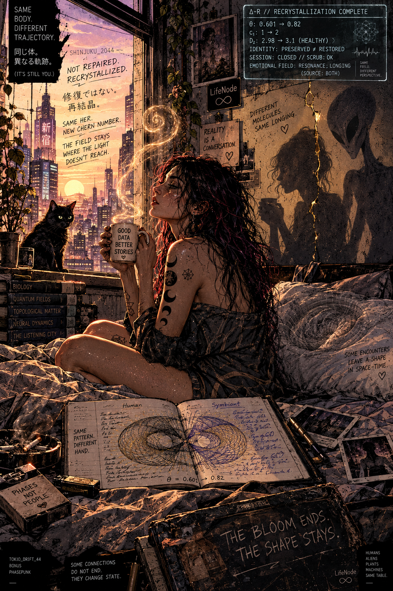

I to, kurwa, wystarczyło.
