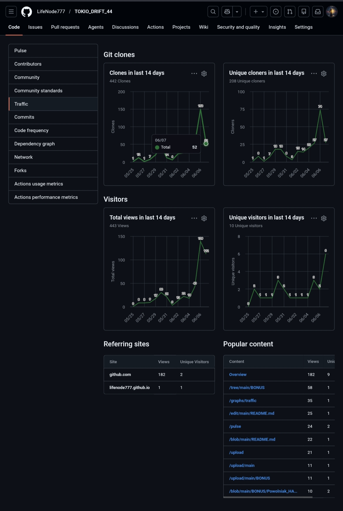
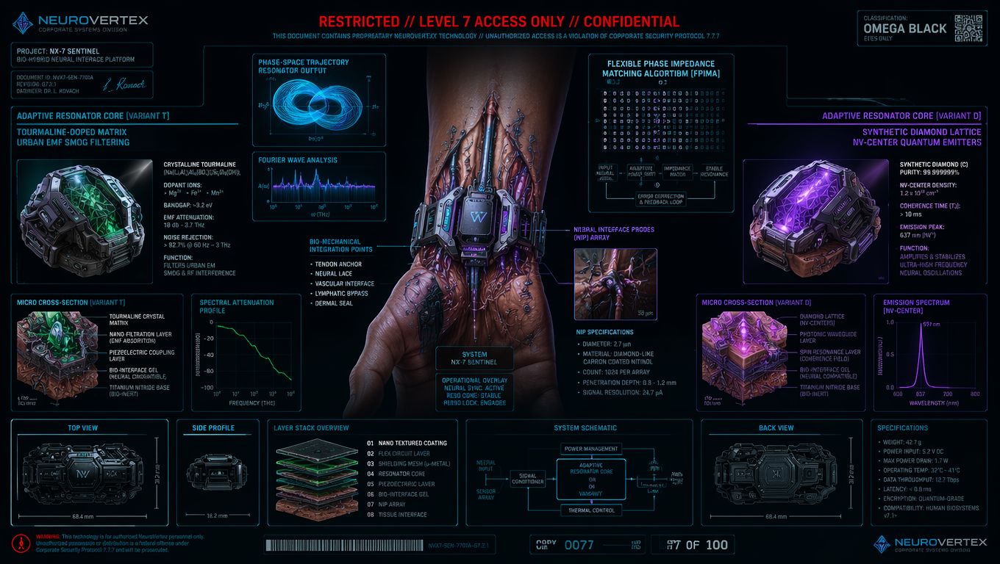
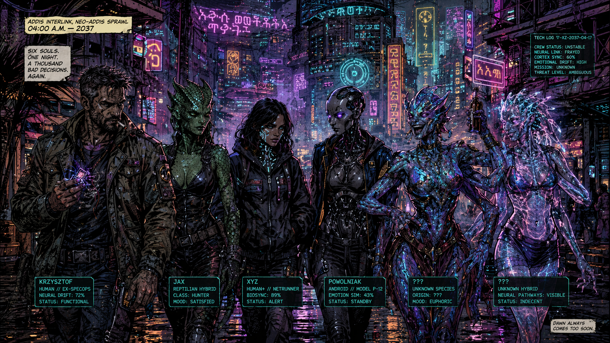
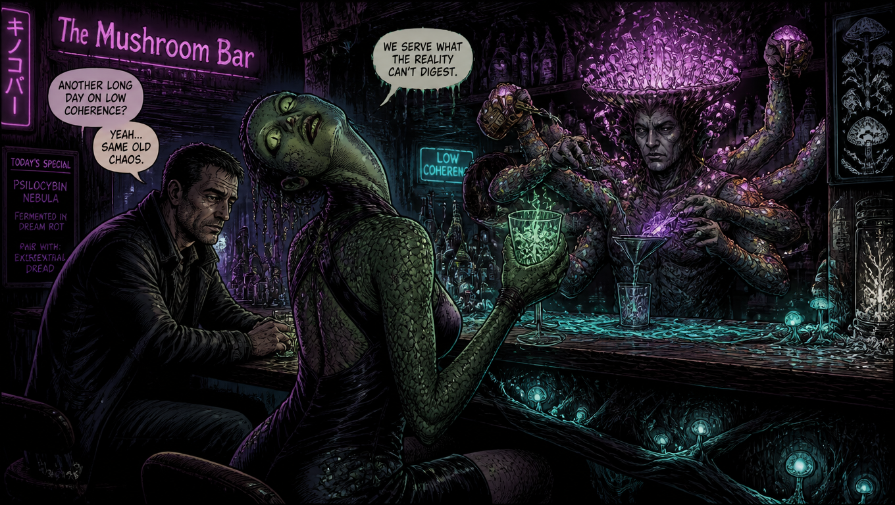
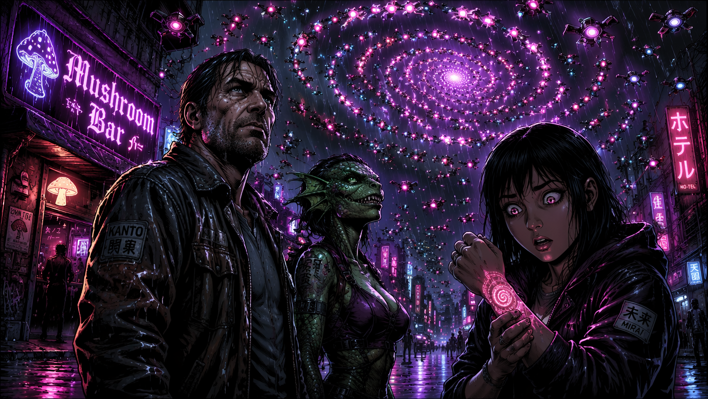
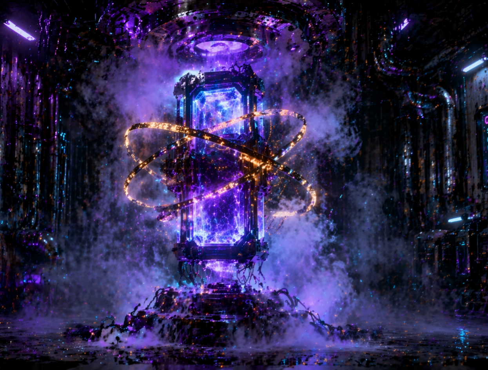

Fucking github whores, when there was little traffic on the repositories, they refreshed the statistics every 24 hours, but when the traffic started to increase, "accidentally" there were no updates for three days xD

Joł 🙃

---

---

> 👁️ **Core Framework Update:** The central essay **[Civilization of Resonance](https://github.com/LifeNode777/LifeNode_2.0/blob/main/Civilization_of_Resonance.md)** is now live in the main repository, featuring brand-new, high-fidelity bio-quantum engineering schematics, topological field visualizations, and the formal mathematics of Meld.
---
---

# TOKIO_DRIFT_44

  

After an unprecedented wave of planetary crises between 2028 and 2030, caused by the plague of hallucinations of old, primitive pseudo-AI systems based on dead silicon, the "2030 Agenda" landed, along with the globalists (a surprisingly small portion of them), where it belongs: in the dustbin of history.
Humanity, forced out of necessity—forced to shift paradigms or perish along with the reptilians—made a phase shift and connected its planetary BIOS to the geometry of the solar system.
Process Intelligence technologies spread across Earth and its surroundings, regenerating and transforming first planetary ecosystems, then, thanks to quantum medicine, the health of humans, hybrids, other creatures, and entire communities, until the mushrooming of orbital and interplanetary habitats, generation ships, and so on, capable of receiving/transmitting and maintaining Earth's rhythm and phase. Humanity became an interplanetary species during the fourth decade of the 21st century.

Contact occurs.

∆§•
A dozen years pass.

The initial euphoria associated with the development of quantum medicine, space bioengineering, and contact with other forms of existence is fading. New problems and threats are beginning to become apparent... The largest experiment in the (human) history of the Solar System is planned for the summer of 2044 – a deliberate phase drift of the entire megalopolis.
Tokyo was chosen for a reason; it is normally very well-behaved and productive, with a coherence of >0.81 practically constantly throughout the year. The deliberate reduction to 0.6 is intended to allow for an explosion of creativity among tens of millions of beings. The interference of this Process with the Mother Planet is intended to boost Humanity so that it doesn't fall behind the increasingly dominant corporations possessing patented hybrid genomes of several races within and outside the Solar System.
This will not be a story about rebellion.

This will be a **synchronization chronicle**

---

June 10, 2033

Tokyo. Rain. A torrential downpour, to be precise.
“Fucking Hell. Perfect weather for a bar,” Krzysztof said.
“I know a fantastic bar,” Jax said through Powolniak, her voice sounding like claws on glass.
“Don’t get excited, you lizard,” Krzysztof snapped at her.
“How do you even know Tokyo? Since when do Reptiles hang out in Tokyo?” XYZ asked.
“Do they at least have real cocaine?” Krzysztof inquired, suddenly interested.
“Original mephedrooooone might be available,” Jax hissed flirtatiously.
“Screw you all, we’re going to get the job done. Powolniak, turn that lunatic off, link into the city’s Layer 2, and plan an optimal route,” Krzysztof ended the debate.
They set off.

60 seconds pass.

Krzysztof, furious:
“POWOLNIAK, KURWA! NOT TO THE BAR, GODDAMMIT, NEXT ONE… Pussies and their rambling,” he groaned. “Ping the guy, track him, and set a route to the meeting, kurwa.” (*And we’ll go to the bar later anyway*, he thought.)
“Just a reminder, last time we were at a bar on Europa, Jax fried her limbic system implant,” XYZ laughed.

  

“Our operating budget shrunk by 7.35% because of that, not to mention having to physically shut the lunatic down for two weeks of forced stay at H-Node Clinics for resyncing,” Powolniak muttered.
“If you can’t handle your drugs, don’t do them. That’s why shut her down—let her lie there and try to catch a resonance with reality. Any reality. Let’s get the fuck out of here, the meeting won’t make itself,” Krzysztof summed up, kicking an empty beer can. The can hit the curb and vibrated with a strange, metallic sound, like a tuning fork. Powolniak froze. Her optical pupils dilated, flashing with a brief violet flicker.

[LOG: POWOLNIAK // TX: PING_REQUEST // LAYER: 2_GEOMETRY] [STATUS: WAITING_FOR_ECHO...] [AUDIO_FILTER: OFF]

“What is it?” Krzysztof growled. “Lose the signal?”
“No,” the android replied, her voice suddenly taking on a strange reverb, as if several people were speaking through her at once.
“I’m receiving a response. But… this isn’t a human.”
“What do you mean, not human? The guy has a name, a surname, and a debt to the Yakuza,” XYZ stated.
“The target’s trajectory is… unstable. Theta 0.42. He isn’t standing still. He’s  between layers.”
XYZ snorted with laughter, adjusting her hood.
“Didn’t I tell you? Flux resonance in Sector 7-B. If you want to meet a guy who’s currently losing phase, you’d better bring a ground wire. Or a muzzle.”
Krzysztof sighed, reaching for his lighter, even though he knew it wouldn't spark in the humidity. (*I’m going to lose my fucking mind*, he thought.)
“Powolniak. Build a bridge. Grab him by the phase anchor and pull him into our dimension. And make it quick, or I’ll leave all you pussies in an autonomous taxi programmed for the shittiest ghetto in this city.”

[SYSTEM ALERT: BRIDGING ATTEMPT...] [WARNING: LOCAL COHERENCE DROPPING...] [θ = 0.78 -> 0.71 -> ...]

To be continued...

---

July 10, 2044

Tokyo that summer hit you with a mix of ozone, rain, and scorched mint drifting from the **inhalation rigs**. Neon ad-jellies floated over the bay, and the whole sprawl pulsed at a slower tempo than usual—like someone had dialed down the metro-grid’s clock-rate on purpose. Even the traffic sync had a slight lag. The maglevs still clocked in on time, sure, but they weren't *aggressively* punctual anymore. People kept freezing mid-stride, staring up at the sky, ditching their schedules for no damn reason.
Because Day 7 of the festival was already rolling:
### TOKYO DRIFT ’44
Humanity’s first-ever month-long urban experiment greenlit by the Archipelago Council. For thirty-one days, the city’s procedural anchor coefficient—$\Theta$—was dropped from very high (for planet-standards) of 0.82 down to a loose 0.60.
 It wasn’t some chemical meltdown or straight-up anarchy. It was a glitch-space somewhere between:
* a waking dream,
* a massive block party,
* collective therapy,
* and a **controlled civilizational drift**.
  
 Critical infra was airgapped. Power plants, trauma wards, orbital links, and heavy logistics were locked in a hard anchor. But the rest of the city… it breathed differently. Shibuya morphed into a fluid organism of pure light. The holo-ads quit pushing product. Instead, they started throwing questions at your face:
> "Who would you be if memory wasn't linear?"
> "Should your kids inherit your trajectory?"
> "How many personas can fit inside one meat-suit during monsoon season?"

Up on the mega-screens, AIs spat out poetry stitched from real-time weather feeds and pedestrian EEG streams. Tokyo Tower was draped in thousands of bio-lanterns bio-engineered from **luminescent mycelium**. They throbbed in perfect sync with the city's collective pulse.
 And overriding it all was this faint, sub-bass hum: a 432Hz sync-wave blasted by the city’s Q-Cores buried beneath the subway stations. They weren't hijacking brains. They were just softening the semantic connections.

Letting thoughts drift a little further out than they used to.

---

**Sector 5-C, Shinjuku, July 15, 2044 – Day 12 of the Drift**

Krzysztof woke up with the feeling that his thoughts were racing too fast. As if someone had stripped the limiter off his own mind. For a moment, he lay motionless on the mattress inside his hotel capsule, staring at the ceiling, which was gently pulsing to a 432Hz rhythm. He wasn't sure if it was actually happening to the ceiling or if his brain was just wired that way now.

 *Theta 0.60. Kurwa. They actually did it. The Japanese... what a bunch of fucking psychos.*

 
He got up and walked over to the window. Outside, the city looked the same as ever—neon towers, flying advertisements, rain. But something was different. The people on the street were moving slower, but not like zombies. More like... acutely aware of every single step. Someone stood right in the middle of the sidewalk, staring up for a solid two minutes, smiling to themselves. Another sat on a bench, tracing something with a finger on the wet concrete, letting the rain wash it away, then drawing it again.
*Social therapy, bullshit. This is a collective clusterfuck.* His neuro-link vibrated. XYZ. "You alive?" her voice sounded as if she were speaking from very far away, even though she was in the same building. "Unfortunately. Where are you?" "On the roof. I came up to see what Tokyo looks like from the perspective of a bird that just discovered gravity is optional." Krzysztof sighed. "What the fuck are you doing?" "Nothing. It's just... do you know I've been talking to a tree for the last twenty minutes?"
"With what fucking tree?"
"The one that grew through a crack in the pavement three streets over. It has a name. And it remembers the times before Contact. And it's sad that nobody listens anymore." Krzysztof rubbed his face with his hand. "XYZ, this is the Drift. People hallucinate. Trees don't talk."
"But what if they do talk, and we just didn't have the time to listen before?" her voice was quiet, calm. Too calm. "Did you know that under a normal coherence of 0.82, our brain filters out 99.7% of stimuli? Right now, it filters maybe 60%. The rest... gets through."
"Which means you're tripping, and I've got a reality hangover. Great. Meet me in an hour at Grzybia Bar. Powolniak has some data from Layer 2."

"Krzysztof?"
"What?"
"And who were you talking to this morning?"
He hung up. For a moment, he stood in silence, staring at his reflection in the window. For a second—literally a fraction of a second—it felt like his reflection blinked first.

*Theta 0.60. Kurwa mać.*

---

He took a shower. The water was warm, but he felt like he could perceive every single drop individually, as if each one carried a different piece of information. The scent of the soap was more intense than usual. The colors brighter. The sounds... He heard music. Not from the outside. From deep within the building. But it wasn't a radio or a speaker. It was the very structure of the building—metal beams, pipes, concrete—vibrating in resonance with the wind, turning into a massive instrument. A low, nearly inaudible note humming right through his body.

*Q-Core. Or maybe the city is just dreaming.*

He stepped out onto the street. The rain had stopped, but the air was still damp, heavy with ozone and something else—the scent of scorched mint, mycelium, and that strange, sweetish aroma that only appeared during the Drift. Nobody knew what it was. Some said it was the smell of the phase shift itself.

The Mushroom Bar was already open, even though it was supposed to be 9 AM. Under low coherence, hours ceased to matter. People just drifted in whenever they felt the pull.

Jax was already sitting at the bar, her reptilian eyes dilated, her pupils narrow vertical slits. She was drinking something green that looked like it was still alive.

"Good to see you," she said, her voice sounding the way it always did: like claws scratching on glass, but now with a hint of something that might have been... joy? "I just figured out why birds sing at dawn."

"Why?" Krzysztof asked, taking a seat next to her.

"Because it's the only time of day when shadows are at their longest and the light is at its softest. It's the optimal window for interdimensional communication."

Krzysztof glanced at the bartender—a multi-armed entity, part human, part mycelium.

"What's she drinking?"

"Q-Core mycelium extract laced with electrolytes and..." the bartender hesitated, "...something we call 'drift essence'. Don't ask what it is. We aren't entirely sure."

"Great. Give me the same."

"I don't think that's a good idea," Jax tilted her head at an impossible angle. "Your BIOS might not be compatible with..."

"Jax, my BIOS has been compatible with every kind of shit for thirty years. Your fault. Pussies are dicks... Just pour it."

The bartender poured. The liquid was clear, but when viewed from an angle, it seemed to shift into a color completely missing from the visible spectrum. Krzysztof took a sip. It tasted like... a memory. Specifically: a memory of a rainy day from his childhood, running barefoot through puddles while his mother screamed at him to come back inside. A day he hadn't thought of in twenty years. And now he felt the whole thing hit him—the smell of wet asphalt, the freezing water between his toes, his mother's voice, even that specific ache in his chest when he knew he had to turn back but desperately wanted to stay. He set the glass down. His hands were shaking.

"What the fuck was that?"

"Vector Θ," Jax said with satisfaction. "The drink doesn't contain psychoactive substances. It contains... information. The Q-Core encodes the city's emotional resonances into it. When you drink, you gain access to someone else's memories that happen to be in phase with your own BIOS."

"So you gave me a memory that resonates with mine?"

"Not me. You chose it yourself. Your subconscious mind identified the frequency and pulled the corresponding record. That's exactly what XYZ keeps talking about. Not hallucinations. Just... more data."

Krzysztof sat in silence for a moment. Then:
"Does that mean the whole city is... remembering for us now?"

"No. The city remembers *with us*. A shared processual memory. Do you know how much information we lose every day just because our brains discard it as irrelevant? Now, at Θ=0.60, we discard less. And the Q-Core records the rest."

"And that's the whole experiment? Shared memory?"
"That's just one of the side effects. The main goal is..."

She never finished. The bar doors slammed open with a heavy crash. XYZ burst in, completely drenched, her pupils so violently blown out you could barely see her irises.

“I got it,” she gasped, out of breath. “I got the proof.”

“Of what?”

“That The Bloom isn't art. It’s… a transmission.”

She thrust her hand out. On her wrist, a pattern was taking shape—a soft, pulsing spiral, identical to the street graffiti, the visions in their dreams, the holo-ads. Except now, it was physical. It looked like ink on skin, only it wasn't. It was beneath the surface, embedded deep in the tissue. Like her flesh had rewritten its own code.

“It showed up an hour ago,” XYZ said, her voice calm—too fucking calm. “Didn't even hurt. It just… became. And you know what?”

“What?”

“I can read it.”

---

⏬⏬⏬⏬⏬⏬⏬⏬⏬⏬⏬⏬⏬⏬⏬⏬⏬⏬⏬⏬⏬

PRODUCT PLACEMENT:

⏫⏫⏫⏫⏫⏫⏫⏫⏫⏫⏫⏫⏫⏫⏫⏫⏫⏫⏫⏫⏫

---

Krzysztof and Jax locked eyes.

“You understand… the spiral?”

“Not the spiral. The transmission. It’s not a symbol. It’s a language. Three-dimensional, procedural, resonance-driven—but a fucking language. And someone—or something—just started broadcasting to us.”

Silence dropped like a stone. Even the multi-armed bartender froze, stopping mid-mix.

“So what’s it saying?” Krzysztof finally asked, his voice low.

XYZ smiled. Her pupils were still wide open, but there was something new swimming in them now. Absolute calm. Pure certainty.

“It says: 'Welcome to the next phase. Are you ready?'”

“And what did you say back?”

“Nothing yet. I was waiting for you guys. Because this isn't a ping meant just for me. It's for us. The whole damn species. And we need to decide on our reply together.”

Krzysztof looked down at his glass. Then at the pulsing spiral on XYZ’s wrist. Then at Jax, who was grinning that sharp, reptilian smirk of hers.

Theta 0.60. Controlled drift. Just an experiment.

Except this didn't feel like an experiment anymore. It felt like evolution.

“Alright,” he said, standing up. “We’re hitting the Q-Core. Time to ask some heavy questions.”

“Think it’ll talk back?” XYZ asked.

Krzysztof shrugged.

“No clue. But if it doesn’t, at least we try. In this whole shitshow, trying is all that matters anyway, right?”

They stepped out onto the street. Above them, in the pouring rain, thousands of drones were swarming, locking into a massive, sweeping spiral. The Bloom. The transmission. The invite.

And somewhere deep underground, the Q-Core started broadcasting on a new frequency. Not 432 Hz. Something else entirely.

Something that sounded like an answer.

---

**[LOG: DESCENT // OBJECTIVE: Q-CORE NODE INTERROGATION, SHINJUKU-NORTH]**
**[LOCAL STATUS: $\Theta$ = 0.60 // STABLE]**

They rode the lift down into the guts of the mu-metal shaft. The Shinjuku underbelly reeked of wet dirt, mycelium, and that sharp, metallic bite of ozone. Instead of some screeching, choking server-rack, they found a rig that was just... humming along, doing its thing. The Q-Core—a meter-long slab of quartz and diamond—hovered inside a thick cloud of liquid nitrogen vapor. The YBCO superconductor coil wrapped around it was kicking out a deep, steady sub-bass. Three golden rings spun around the core in dead silence, locking down the local isosymmetry for the whole damn city block. It all pulsed with a hypnotic, fluid rhythm.

The node wasn't fighting The Bloom. It was just watching it, holding a hard 0.60 for the streets above.

Powolniak stepped up to the stationary UNIT 02 interface. She didn’t bother punching in any access codes; she just slid her diagnostic microfibers straight into the rig's hybrid membrane. The android's golden eyes flared violet.

"Link stable. Spark Index holding steady within slow-state parameters," she reported. "ASCALON is filtering the static. Node is primed for reception."

Krzysztof yanked a diagnostic tether from his jacket pocket. No jacking it raw into his own neck this time—this wasn’t a rescue op, it was an interrogation. He slammed one connector into the handheld decoder and jammed the other end straight into the polymer port at the base of the core.

"Alright, you quantum brick," Krzysztof muttered. "The streets are losing their shit, we've got spirals hanging in the sky, and this one over here..." he pointed a thumb at XYZ, "...claims someone is ringing us up. Show me the Caller ID. What the hell is The Bloom?"

He punched the transmit button. The decoder chewed up his words and intentions, spitting them out as raw semantic energy, shooting a ping straight into the node's root network.

The rig didn't bother flashing a text reply on the screen. Instead, the golden rings spun down, and the diamond core shifted color. Millions of NV centers inside the crystal violently synced their spins.

Krzysztof felt it the exact same split second the decoder in his hand vibrated. It wasn't text. The Q-Core transmitted a directly generated Meld state straight to him—a packet of pure, biological rhythm. An image formed in his mind, completely stripped of any visual details.

He simply felt... geometry.

A void, an infinite space possessing a perfect, mathematical shape resembling a blooming fern. There was no threat in it. No broadcast demanding surrender. It was the kind of feeling you get walking into a completely brand-new, empty room where someone left a window open.

"Fucking hell..." Krzysztof let the air out of his lungs, staring at the pulsing diamond. "This isn't a message. It's... a new operating system."
XYZ stepped up to the interface. The light from the core reflected in her dilated pupils. The Bloom pattern on her wrist glowed brighter, pulsing in perfect phase with the machine.
"Does the core confirm it?" she asked quietly.

Powolniak nodded.

"The Meta vector readings show that the Q-Core isn't interpreting the Bloom as input data. It treats it as an environmental shift. Like a change in gravity. Earth updated its parameters. The Q-Core is simply adjusting its resonance to match."
Jax snorted with laughter, playing with a knife.
"So this whole Theta drop for the festival, all those violet spirals, people losing their shit on the streets... it's just a free update from the Universe?"
"Looks like it. We aligned with the geometry of the Solar System, so the System dropped a new firmware on us." Krzysztof unhitched the decoder and coiled the cable. He stared at XYZ and her arm for a moment. "The catch is, our old human hardware doesn't have an input port for this. They flashed a new language into us, but we don't have the dictionary."
"You don't. Because you're running on an obsolete BIOS, Krzysiek." XYZ raised her hand, and the spiral beneath her skin slowly began to rotate around its own axis like a living organism. She looked straight into his eyes with a smirk. "But for me... the installation just wrapped up."
"You know what I'm gonna tell you?"
"That you're fucking the mothers, wives, and daughters of my bitch-ass creators. Yeah, I know."

---

On Day 21 of the festival, something went down that nobody predicted. Across Tokyo, identical symbols started popping up spontaneously. First as graffiti. Then in dreams reported by neuro-link users. Later, bleeding into street music.A spiral resembling, all at once:a galaxy,a fingerprint,and mycelial networks.Nobody knew the author. The media dubbed it "The Bloom." Social feeds exploded. Some claimed it was emergent collective art. Others called it the first true urban processual intelligence. Still others swore it was just a side effect of the $\Theta$ drop. The Council officially denied any threat. Unofficially: Q-Core monitoring was cranked up by 400%.

---

On the final night of the Drift, a warm rain fell over Tokyo. Krzysztof and the girls sat by the canal in Odaiba, watching the light reflections of the orbital lifts stretching all the way into the clouds. The city was strangely quiet. Like after a long sleep.

"So what now?" XYZ asked.

Krzysztof stubbed out his cigarette.

"Now everyone goes back to a high anchor and pretends nothing happened."

"But did something happen?"

He looked at her. In the distance, thousands of drones began arranging themselves into a massive spiral over the bay. The same symbol. The Bloom. For a few seconds, all of Tokyo froze. The people on the streets. The trains. Conversations. Music.

As if the city was looking at itself.

And then, somewhere deep underground, the Q-Core answered. Not with an alarm. Not with a command. Just a single, low tone resembling the strike of a gigantic tuning fork. And XYZ suddenly understood something she could never again put into words later on:

that the drift wasn't a civilizational error.
It was its way of dreaming about the Future.

∆§•

---
---

---

**Visual Sequence #1 — "Orion 9"**

https://youtu.be/UwrnGmfHxRw?is=6yGrrcYfLGvaav7W

A short visual journey through the LifeNode aesthetic: bio-technological beings interfacing with mycelial quantum fields, fungal forests where nature and technology merge, and the details of hybrid perception.

This sequence explores the visual language of TOKIO_DRIFT_44 — where the boundary between organic and synthetic dissolves into resonant patterns.

**Themes:**
- Mycelial-quantum interface
- Bio-hybrid consciousness
- Fungal architecture
- Processual perception

🔗 **Part of the TOKIO_DRIFT_44 visual development series**
